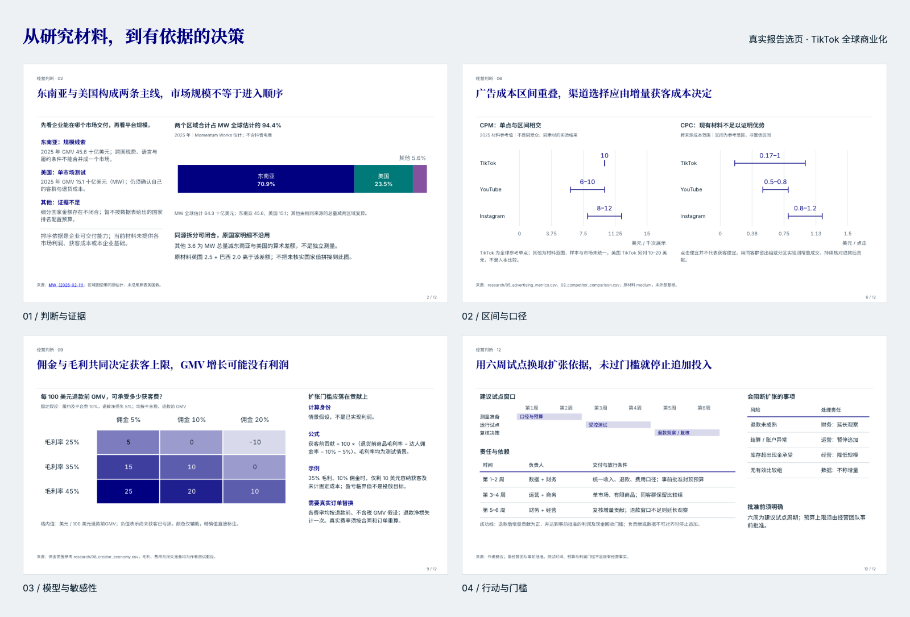

# Consulting Report Forge

### 把研究和数据，做成有依据、能推动决策的咨询报告。

**Consulting Report Forge（咨询报告锻造）** 是一个面向 AI Agent 的报告制作技能。给它原始表格、行业资料、访谈记录、财务数据或已确认的分析稿，它会围绕读者要做的选择，组织分析、搭建故事线、制作图表，最终交付一份可离线阅读的 **HTML 报告与同版 PDF**。

适合需要把复杂信息讲清楚、把判断依据摆出来的战略、咨询、研究和经营分析工作。

[](docs/showcase/report-overview.png)

**当前版本：1.3.0。** 保留静态报告的版式与字体体系，新增按业务问题选方法、主笔与按需专家协作、统一内容蓝图及可追溯审查。已完成六页合成任务验证和20页MES同材料完整报告验证；范围与局限见[升级验证记录](docs/upgrade-validation.md)和[MES对照分析](docs/mes-full-evaluation.md)。

**[快速开始](#快速开始) · [报告样例](#报告样例) · [布局系统](#布局系统) · [图表能力](#图表能力) · [最佳实践](#最佳实践) · [Apache 2.0](LICENSE)**

## 它解决什么问题

做报告最耗精力的环节，往往是从材料到判断的那一段：数据很多却不知道该证明什么；有结论却找不到合适的图；单页看着不错，连起来却没有主线；浏览器里正常，导出的 PDF 又掉字、错位。

这个技能把这些工作放进同一条制作流程。

| 你面临的问题 | 它会怎么处理 | 带来的价值 |
|---|---|---|
| 材料堆积，重点不清楚 | 先确定读者、决策问题与必须回答的问题，再组织证据 | 报告围绕选择展开，减少无关信息 |
| 结论和图表各说各话 | 每页声明要证明的关系，再选择主展品和支持证据 | 读者能在图上看到标题的依据 |
| 不同来源、期间和口径混在一起 | 区分事实、估计、假设、预测与建议，保留分母和限制 | 判断的适用条件更清楚，也更容易复核 |
| 排版和反复修图占用大量时间 | 复用布局、图表和字体体系，逐页预览并修正 | 把精力更多放在分析与取舍上 |
| 成稿难分享，导出容易走样 | 内嵌资源，检查最终 HTML 与 PDF，再打包交付 | 接收者无需安装制作环境即可阅读 |

## 你会拿到什么

- **一份可独立分享的 HTML**：字体和图表随文件交付，支持离线翻页、全屏、整册总览和页码链接；打包后的成品内置同版 PDF 下载。
- **一份独立 PDF**：用于邮件发送、归档和打印。图表以静态矢量形式装配，关键数据直接可见。
- **可继续修改的制作底稿**：页面蓝图、页面源稿和任务配置，让后续更新有据可循。
- **与成稿对应的检查记录**：包括页面截图、自动审计与审查记录。复杂分析或重大决策材料还要求独立复核。

默认采用中文、16:9、白底与深蓝强调色、中文衬线粗体标题。支持 4:3、阅读与讲述两种模式，以及 `mckinsey`、`bcg`、`accenture` 三套主题；这些是独立视觉适配，**并非相关公司的官方模板，也不代表其认可**。

## 报告样例

以下四页来自本项目实际跑通的 **《TikTok 全球商业化：市场与渠道投入优先级》**。整册共 15 页，包含 12 页正文；以企业经营团队的市场和渠道选择为问题，完成过 HTML/PDF 验收。这里展示优化后回归渲染的选页，保留页面上的来源、期间和限制。

| 判断与证据 | 区间与口径 |
|---|---|
| [](docs/showcase/report-priority.png) | [](docs/showcase/report-ranges.png) |
| 市场规模回答机会在哪里；交付条件回答企业先去哪里。 | 范围数据保留为区间，不把不同指标拼成一个排名。 |

| 模型与敏感性 | 行动与门槛 |
|---|---|
| [](docs/showcase/report-sensitivity.png) | [](docs/showcase/report-action.png) |
| 把假设写在页面上，让读者看到结论随条件怎样变化。 | 将建议落到试验步骤、观察指标和继续投入的条件。 |

点击图片可看原尺寸。样例用于展示制作效果，商业信息具有时效性，不应直接当作当前市场建议。素材来源和复现方式见[样例说明](docs/showcase/README.md)。

## 功能亮点

### 先搭论证，再开始画页

技能会先形成整册总判断与结论型标题链，再为每页写清“这一页要证明什么”。蓝图是制作依据；制作中改变结论、主图或页面结构，需要同步更新并检查一致性。

从第一页到最后一页，读者应能顺着标题理解：为什么要做这个决定、证据说明了什么、有哪些取舍、建议如何验证。

### 主笔负责整篇，专家按缺口加入

主笔统一业务判断、方法和标题链；研究、计算或领域知识出现明确缺口时，才启用相应专家。复杂或重大材料使用实际独立实例，分别复核制作前的论证和最终成稿。没有独立实例时如实保留未验收状态，不靠换一个角色名称替代独立审查。

### 丰富表达，服务真实关系

内置 **30 种正文布局**，并提供比较、趋势、构成、分布、相关、流向、层级、达成度、机制与流程等表达方式。选择依据是数据之间的关系：前后差距用哑铃图，增减贡献用瀑布图，规模与结构同时看用 Mekko 图。

组件会检查部分数据和容量约束。没有现成组件时，可以使用自定义 SVG 与自定义阅读区域；自定义内容仍需接受实际预览和审查。新稿不设最低图型或布局种数，合理重复与留白通过实际阅读判断；溢出、不可读和算术错误仍会阻止交付。

### 让数字能够被追问

关键主张可以记录来源、统计期间、单位、分母、计算过程、推断与限制。瀑布图检查起点、增量与终点是否闭合；桑基图检查中间节点流量守恒；未知值不能被随手填成零。来源尚未核实的地方，要保留其状态。

这使报告更适合讨论和复核，也让“证据不足”能够成为明确结论。

### 同一份内容，贯穿标题、图表和注释

新稿以蓝图 v2 维护关键主张、来源、指标与推理边界，编译成页面合同 v4。关键数字使用统一计算结果；在标题、图表和注释中复用时，一次修改即可同步。事实、预测和假设的身份随内容进入页面，装配与最终检查都会核对可见文字。

绑定保证声明的内容进入成稿，不能替代对来源、方法或结论的判断。使用方式见[内容制作说明](references/content-authoring.md)。

### 同时检查内容与最终成品

制作按“问题与分析 → 标题链与蓝图 → 2–3张代表页 → 整册制作 → HTML/PDF验收与独立审查 → 打包”推进。自动检查覆盖布局、部分文字与图表约束、关键内容、字体和最终输出等工程问题；视觉审查与独立复核负责机器规则无法判断的论证与可读性。

已完成的审查可以连同报告、截图与来源记录归档。修订时，仅同一审查者看过且证据未变的页面可复用；变化页、整篇判断和当前告警仍须重新确认。工具只生成待审草稿，不自动代签。详见[审查复用说明](references/review-reuse.md)。

**自动通过不等于商业判断正确。** 技能会区分有脚本强制检查的规则与需要作者、复核者判断的要求。

## 布局系统

**30 套正文布局原型，并支持自定义阅读区域。** 核心判断放在哪里，证据怎样展开，条件如何与结论对应，行动如何与责任连接，都有适合的组织方式。

以下四种方案直接来自内置 **Layout Atlas**。矩形的大小和位置沿用真实布局，模块名称也来自同一份目录；可以点击图片查看细节。

[](docs/showcase/layout-featured.png)

- **用主辅关系安排注意力。** 综合研判可以把判断放在中轴、条件分布四侧；指标诊断可以沿总量、驱动与口径逐层展开。
- **用阅读顺序组织推理。** 两项议题沿相同路径并读，计划与风险在同页对应，让读者更容易比较、核对和采取行动。
- **用统一网格控制交付质量。** 目录布局采用 12×6 网格，支持 16:9 与 4:3；模块位置、内容职责和文字容量有明确约定，最终页面还会检查实际落位。自定义布局声明各区域的职责和主辅关系，并接受相同的可读性与交付检查。

图谱同时提供每套方案的**适用场景、阅读路径、使用代价、禁用条件和逐格容量**。选完结构后，再为各模块选择图表或文字；图表已有最低尺寸约束时，还会提前排除放不下的组合。

<details>
<summary><strong>展开查看全部 30 套正文布局</strong></summary>

[](docs/showcase/layout-overview.png)

覆盖证据展开、方案对照、指标拆解、同尺度小图、责任矩阵、路线图和决策摘要等任务。布局的用途还取决于模块职责，几何相同的方案也可能服务于不同的论证。

</details>

<details>
<summary><strong>展开查看真实图谱界面：选型、网格与容量</strong></summary>

[](docs/showcase/layout-atlas-workbench.png)

上图是随包图谱的实际界面。下载仓库后，用浏览器打开 [layout-atlas.html](assets/layout-atlas.html)，即可切换布局、画幅、结构与容量视图。图片生成方式见[样例说明](docs/showcase/README.md#布局图谱演示)。

</details>

## 图表能力

下面六张是用本项目渲染器新生成的能力演示，**全部使用虚构数据**，页面内也有标注。它们展示具体图表的表达方式，不冒充完整报告的验收样本。

| 桑基图：钱或流量去了哪里 | 瀑布图：变化由哪些增减项组成 |
|---|---|
| [](docs/showcase/chart-sankey.png) | [](docs/showcase/chart-waterfall.png) |
| 适合渠道流向、资源分配、收入去向；中间节点需要守恒。 | 适合利润桥接、收入变动、分类贡献；增减之和必须对得上。 |

| Mekko 图：规模与内部结构一起看 | 矩阵热力图：结论如何随条件变化 |
|---|---|
| [](docs/showcase/chart-mekko.png) | [](docs/showcase/chart-heatmap.png) |
| 列宽表示规模，列内高度表示份额，面积对应绝对量。 | 适合敏感性分析、跨维度比较；配合固定色阶和直接数值。 |

| 哑铃图：改善幅度与期末水平 | 子弹图：实际值离目标有多远 |
|---|---|
| [](docs/showcase/chart-dumbbell.png) | [](docs/showcase/chart-bullet.png) |
| 用同一量尺比较两期，更容易发现差距和追赶幅度。 | 将实际、目标与量尺放在同一行，适合经营指标检查。 |

其他支持的表达包括排序条形、分组柱状、折线、构成条、堆积图、直方图、散点与气泡、坡度图、层级树、泳道、阶段流程、条件决策树、评估矩阵与精确数据表。完整选型逻辑见[表达指南](references/expression-guide.md)；安装后可运行 `node scripts/sweep_forms.cjs` 查看当前清单和容量条件。

## 使用场景

| 场景 | 值得交给它的问题 | 建议提供的材料 |
|---|---|---|
| 战略与市场进入 | 下一个市场先进入哪里，哪些条件不满足就暂缓？ | 市场数据、竞争资料、企业能力与投入约束 |
| 经营复盘 | 增长发生在哪里，利润为什么没有同步改善？ | 分期经营明细、成本费用、渠道与产品结构 |
| 投资与项目评估 | 哪些证据支持投入，哪些假设会改变判断？ | 财务数据、访谈、行业研究、估值或回报假设 |
| 产品与增长分析 | 哪些客群或渠道值得扩大试验？ | 漏斗、留存、获客成本、实验结果与样本口径 |
| 管理层汇报 | 需要批准什么，投入多少，如何判断有效？ | 已确认结论、预算、里程碑、责任与风险 |
| 研究稿转报告 | 如何保留原有事实和观点，重组为可阅读的视觉报告？ | 完整文稿、原始表格、必须保留的限定 |

支持三种工作方式：从材料开始分析、围绕问题开展开放研究，以及对已确认文稿做编辑重组。外部检索取决于 Agent 的工具能力与用户授权，技能本身不附带付费数据源。

## 快速开始

### 1. 准备能执行技能的 Agent

Agent 需要能够读取文件、执行本地命令、查看实际截图，并有足够的上下文处理原始材料。复杂分析与重大决策材料还需要独立复核能力。纯文本聊天窗口无法完成整套本地制稿与视觉验收。

建议选择具备较强推理、编程和读图能力的多模态模型。成稿质量仍取决于输入材料、模型能力与实际复核。

### 2. 获取技能并安装制作依赖

```sh
git clone https://github.com/ZeroxZhang/consulting-report-forge.git
cd consulting-report-forge
npm ci
npm run setup-fonts
```

将**整个目录**放到你的 Agent 支持的技能目录中，或在任务中明确让 Agent 读取本目录的 `SKILL.md`。不要只复制入口文件，它还需要随包的脚本、字体、模板和参考文档。

制作环境要求：

| 依赖 | 用途 |
|---|---|
| Node.js **20+** 与 npm | 装配、渲染与审计；当前锁定依赖要求至少 Node 20 |
| Python **3.10+** | 生成字体子集；`setup-fonts` 自动选择合适解释器并建立本地虚拟环境 |
| Chrome 或 Playwright Chromium | 页面预览与 PDF 导出 |
| Poppler（`pdfinfo`、`pdffonts`、`pdftotext`） | 最终 PDF 检查 |

本项目展示的完整运行在 macOS 完成。字体安装脚本使用 POSIX shell 和 `bin/python` 路径；Windows 原生环境未验证，可在 WSL 中准备依赖。**报告接收者只需要浏览器或 PDF 阅读器。**

没有 Chrome 时可用 `npx playwright install chromium` 安装浏览器，并为后续制稿命令设置 `CHROME_CHANNEL=chromium`。首次运行请让 Agent 完成环境及读图探测，具体步骤见[安装与环境探测](references/static-html-pdf.md#安装与环境)。

### 3. 像交代一项研究工作一样下任务

可以直接把下面这段交给 Agent，替换材料路径和问题：

```text
使用 consulting-report-forge 制作一份经营分析报告。

读者：企业经营团队，需要决定未来两个季度优先投入的市场与渠道。
材料：./research/ 下的研究文档和原始数据。
必须回答：机会在哪里、我们是否具备进入条件、哪些投入先试验再扩大。
证据要求：区分事实、估计与假设；保留来源、期间和口径。
调研范围：先用已有材料；发现会改变判断的数据冲突时做针对性事实核查。
交付：中文、16:9、阅读型 HTML + 同版 PDF。
工作目录：全部中间文件和成稿放在 ./runs/market-priority/，并加入 Git 忽略。
请先给出总判断和标题链，再按技能流程制作、复核并完成交付。
```

无需提前规定每页用什么图。给清楚问题和约束，让技能根据证据选择表达。

### 4. 更新现有安装

已通过 Git 安装时，在技能目录先确认自己的改动已妥善保存，再执行：

```sh
git pull --ff-only
npm ci
```

新任务使用 `templates/deck-blueprint-v2.json`，由编译器生成 `pages.json`；不要手工维护两份内容。旧蓝图 v1 与页面合同 v1–v3 保留兼容，已有报告无需为升级强制重写。各 Agent 若以软链接指向同一技能目录，更新该目录即可使用新版本。

## 最佳实践

**先写一个要做的决定。** “研究宠物食品行业”范围太宽；“判断是否进入高端猫主粮，以及先验证哪些条件”更能指导材料取舍。受众、决策、材料路径和硬约束，是最值得先说清的四件事。

**提供原始材料，也提供口径。** 原始表格、完整访谈与财务明细能支撑计算和比较。给出统计期间、币种、含税口径、样本范围与缺失值，比补几句摘要更有帮助。

**把事实核查的边界说明白。** 可以指定“只用现有材料”，也可以允许针对性核实。材料冲突时应记录差异、降低结论强度或保留区间；演示数据要显式标注为虚构，不能混进真实研究。

**先看标题链，再看整册。** 尽早确认报告是否回答了真正的问题，能避免画完几十页才发现方向偏了。需要阶段评审时，可以明确要求先看蓝图或几页样张；默认流程会自主推进，不逐页等待批准。

**让页数和图型服从论证。** 指定篇幅上限通常比指定“必须 30 页”更有用。桑基、Mekko、矩阵等形式应有对应的数据关系，不为展示能力硬凑图表。

**提前给出行动门槛。** 预算、回报要求、退出条件、责任人和可接受风险，会直接影响建议。没有企业自身数据时，应把结论写成验证顺序或试验方案。

**给复杂任务留出制作与复核时间。** 原始材料分析、逐页渲染、返工和独立复核会消耗较多时间与 token。超过 10 页正文、涉及外部检索或独立复核的任务会在开工时说明规模；不承诺固定分钟数完成。

**将制稿目录与技能源码分开。** 每次任务使用独立目录并按需要忽略，保留可复现底稿。最终分享打包后的成品；迭代截图或尚未验收的 HTML 不应被当作正式交付。

## 能力边界

- 交付格式是 **HTML + PDF**，当前不输出可编辑 PPT/PPTX。
- 它是一套由 Agent 执行的技能和本地工具链，没有独立的在线编辑器；单张图、海报和纯格式转换不属于主要使用范围。
- 证据记录和自动校验帮助发现问题，但不保证所有事实都已外部核实，也不能替代专业判断。
- 无法实际看图、导出最终媒介或完成所需复核时，应明确标为未验收，不能用脚本通过冒充交付完成。
- `research/` 用于存放本地研究材料，默认被 Git 忽略，不随仓库分发；使用时请自行准备材料并确认来源与时效。

## 深入了解与参与改进

| 你想了解 | 从这里开始 |
|---|---|
| Agent 如何执行整套流程 | [技能入口](SKILL.md) |
| 怎样选择分析方法、避免推理越界 | [分析方法路由](references/analysis-methods.md) |
| 怎样分配主笔、专家与独立复核 | [协作协议](references/collaboration.md) |
| 怎样统一内容并进行后续修订 | [内容制作](references/content-authoring.md) · [审查复用](references/review-reuse.md) |
| 怎样组织总判断、标题链与取舍 | [咨询叙事与决策架构](references/consulting-storyline.md) |
| 有哪些页面骨架 | [布局目录](assets/layout-atlas/catalog.json) · [布局图谱 HTML](assets/layout-atlas.html)（下载后用浏览器打开） |
| 如何选择图表与表达 | [表达指南](references/expression-guide.md) |
| 如何记录证据身份与限制 | [证据身份记录](references/evidence-ledger.md) |
| 如何制作、验收和打包 | [静态 HTML/PDF 路线](references/static-html-pdf.md) · [视觉与证据验收](references/visual-qa.md) |
| 如何复现 README 的图表演示 | [样例说明与生成入口](docs/showcase/README.md) |

欢迎通过 [Issues](https://github.com/ZeroxZhang/consulting-report-forge/issues) 提交真实制稿中遇到的问题。提供最小复现材料、预期行为、实际截图与相关审计输出，会更容易定位问题；请先移除私人数据。

维护者可运行以下检查，需先完成制作环境安装：

```sh
npm test                     # 计算、合同、兼容性与审查复用
npm run test:render          # 浏览器布局及瀑布绑定回归
npm run test:upgrade-render  # 新内容蓝图的HTML/PDF集成与反例
```

[行为评估任务](evals/README.md)另用于观察实际Agent的分析和制稿表现；工程夹具不等于创作能力验证。字体缓存专项检查为 `.font-venv/bin/python scripts/test_font_cache.py`。这些检查各有范围，完整报告仍需走自己的最终验收。

## 开源许可与致谢

本项目原创代码、技能说明及原创演示素材以 **[Apache License 2.0](LICENSE)** 开源，支持在遵守许可证条件下使用、修改和分发，包括商业使用。完整条款以仓库许可证及 [Apache 官方文本](https://www.apache.org/licenses/LICENSE-2.0) 为准。

随包运行时基于作者的 [Consulting Deck Skill · Concise](https://github.com/ZeroxZhang/consultancy_charts_concise/tree/main/consulting_deck_skill_concise) 重组。字体保留 SIL Open Font License；第三方依赖、原始研究来源和商标继续适用各自的权利与许可，不因本仓库开源而改变。归因与组件说明见 [NOTICE](NOTICE) 和 [第三方说明](THIRD_PARTY_NOTICES.md)。
