<div align="center">

# Consulting Report Forge

### 让你的 AI Agent，完成从深度研究到决策报告的咨询工作。

深度调研 · 商业分析 · 专家协作 · 数据建模 · Storyline · 视觉报告

[](package.json) [](LICENSE) [](#你会拿到什么) [](#快速开始) [](https://github.com/ZeroxZhang/consulting-report-forge/stargazers)

**[看成稿](#报告样例) · [了解能力](#核心能力) · [开始使用](#快速开始) · [阅读文档](#文档与验证)**

</div>

**Consulting Report Forge 是一套面向 AI Agent 的咨询研究与报告交付技能。** 它把资深咨询顾问在问题定义、深度调研、商业分析、数据建模、论证组织和成果表达中的工作方法，组织成可执行的流程。

从“这个市场值不值得进入”，到“增长为什么没有带来利润”，你可以交给它一个需要回答的业务问题，以及已有材料和约束。它会拆解问题、查找与核对证据、选择分析框架、完成计算、形成判断，再用清楚的 storyline 和图表组织成可离线分享的 **HTML + 同版 PDF**。

面向需要研究深度与专业表达的战略团队、咨询顾问、行业研究人员和经营管理者。

**你希望得到的，是一次有依据的讨论：机会在哪里，判断为什么成立，有哪些选择，下一步怎么验证。**

[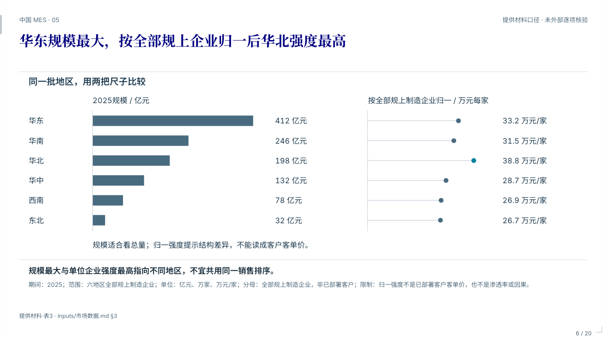](docs/showcase/mes-regions.png)

*实际成稿选页：同一组市场，用规模与归一化强度回答不同问题。分析方法决定比较方式，页面把判断依据展示出来。点击可查看原尺寸。*

## 从一个业务问题开始

| 你带来的问题 | 技能推进的工作 | 你获得的判断依据 |
|---|---|---|
| 这个行业有多大，机会在哪里？ | 定义市场边界，研究产业链与竞争格局，核对规模和增长口径 | 机会分布、进入条件和需要补证的关键假设 |
| 收入增长了，为什么利润没改善？ | 拆解量价、产品与渠道结构，检查成本行为和单位经济 | 增长贡献、盈利约束与值得验证的经营解释 |
| 几个方向都能做，优先选哪个？ | 比较现状与备选，分析收益、资源、风险及敏感性 | 选择依据、取舍和会改变推荐的条件 |
| 材料很多，怎样向管理层讲清楚？ | 提炼总判断，搭建 storyline，将每页主张与证据对应 | 一份能够沿标题读懂、沿来源复核的报告 |

**问题定义 → 深度调研 → 框架与数据分析 → 判断与取舍 → Storyline → 视觉报告 → 独立复核**

流程按任务展开：已有成熟分析稿时保留原意并重组表达；需要研究时深入证据与方法；复杂任务按需加入研究、建模和行业分析 Agent。

## 核心能力

### 01 · 深度调研：找到能够改变判断的证据

围绕核心问题拆出研究议题，梳理已有材料与缺口，再对关键来源、冲突数据和替代解释做针对性调查。可以结合用户文档、公开资料、原始数据和已有访谈记录，追溯出处，核对时期、样本与统计范围。

研究结果会进入后续判断：哪些事实支持结论，哪些反例会推翻它，哪些未知值得继续投入研究。开放检索通过 Agent 可用且获授权的工具执行；技能不附带付费数据库或真人专家访问服务。

### 02 · 商业分析框架：让方法帮助回答问题

从业务问题选择方法，再把框架落实为比较、计算与取舍。可按需采用问题树与盈利驱动树、量价组合分解、自上而下／自下而上的市场规模测算、五力、价值链与利润池、单位经济、情景与敏感性分析。

例如，判断市场进入机会时，会把行业规模、竞争条件、进入方式、投入约束和单位经济连起来；诊断增长时，会继续追问利润、现金与交付能力。框架的价值体现在能否改变答案，实际采用哪些方法取决于数据与任务。

### 03 · 数据分析与建模：让结论经得起追问

核对期间、单位、分母和缺失值，完成增长贡献、结构差异、归一化比较、单位经济及情景计算。需要更复杂的方法时，可通过可复算脚本或工作表完成，并保留输入、公式、假设与结果之间的关系。

定性材料同样进入分析：对访谈和案例按主体、动作、条件与反例组织证据。定量与定性结果共同支撑判断；读者可以区分观测事实、推断、预测和假设，也能看到结论在什么条件下会改变。

### 04 · 咨询专家协作：把研究、模型与行业判断接起来

采用**主笔统筹、专家按需参与、独立实例复核**的协作方式。主笔负责问题、总判断与完整故事线；研究、建模和行业分析 Agent 分别解决具体缺口，将来源、计算、约束和不同意见交回主笔综合。

这里的“专家”是承担不同分析职责的 AI Agent。复杂或重大材料还会由未参与相关内容制作的实例质疑推理、复核成稿，使分工后的结论保持一致，并暴露需要修正的地方。

### 05 · Storyline：把研究发现组织成决策叙事

先提炼整份报告的总判断，再搭建“问题—证据—洞察—取舍—行动”的推进关系。每页有明确任务，标题说出有依据的发现，图表展示支持它的证据，限定说明结论的适用范围。

读者能沿着标题链理解整篇论证，也能回到具体页面追问依据。探索性研究可以收束为有限发现和下一步验证；面向决策的报告则明确选项、代价，以及继续或停止的条件。

### 06 · 视觉表达：让分析成为可阅读的报告

先制作核心定量页、复杂页和定性／行动页等代表页，确认信息密度、字号、留白与阅读顺序，再扩展全册。图表表达真实关系，布局安排阅读节奏，注释与来源保留判断的依据。

**布局、密度与留白一起设计。**

内置 **30 套正文布局原型**，并支持自定义阅读区域。主证据、解释、注释与来源有各自的位置；同类页面可以合理重复，也允许为阅读停顿保留空间。

[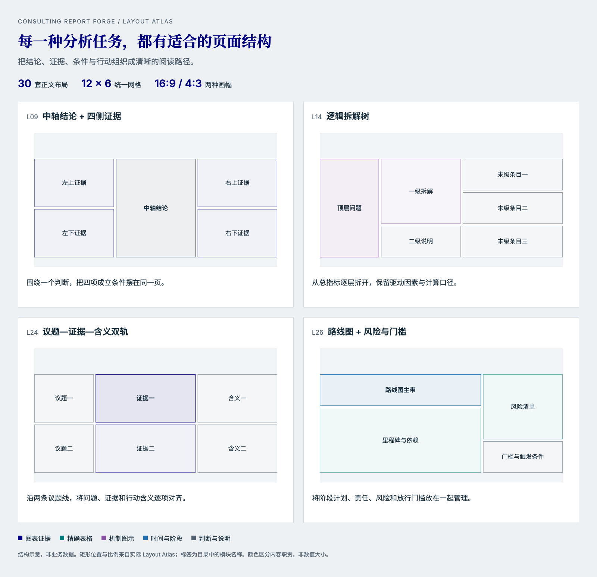](docs/showcase/layout-featured.png)

默认中文、16:9、白底深蓝与中文衬线粗体标题；支持 4:3、阅读／讲述模式，以及 `mckinsey`、`bcg`、`accenture` 视觉主题。这些是独立视觉适配，并非相关公司的官方模板或背书。

<details>
<summary><strong>展开布局图谱：30 套正文原型与选型界面</strong></summary>

[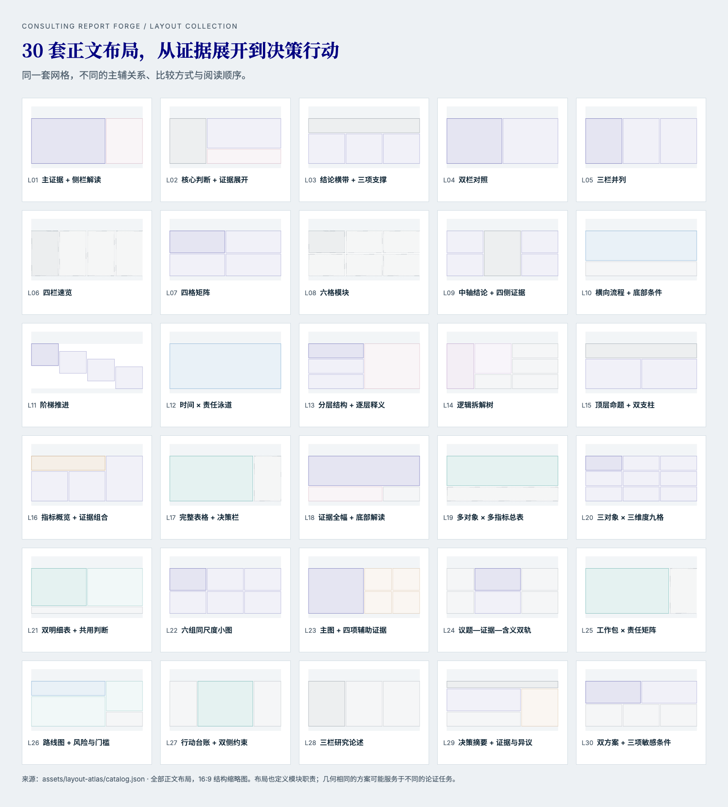](docs/showcase/layout-overview.png)

目录布局采用 12×6 网格，记录适用场景、阅读路径、容量与禁用条件。自定义布局声明区域职责，并接受相同的可读性和交付检查。

[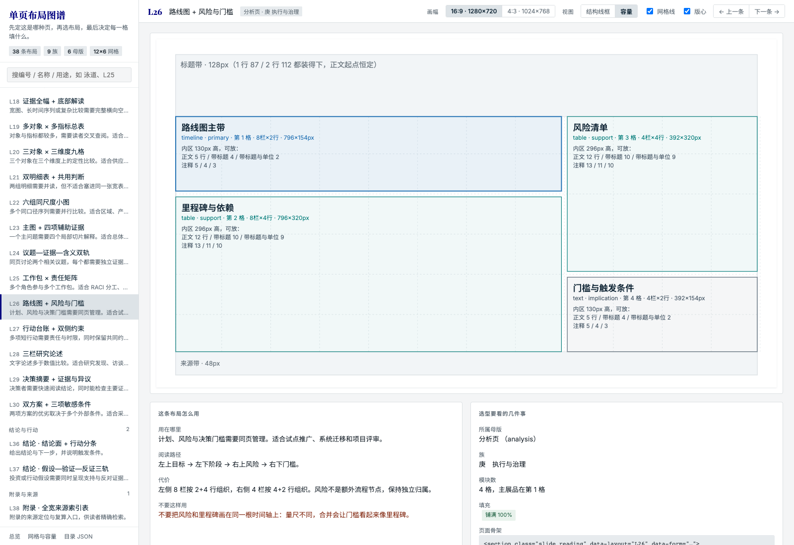](docs/showcase/layout-atlas-workbench.png)

下载后用浏览器打开 [Layout Atlas](assets/layout-atlas.html)，查看布局、画幅及容量。

</details>

**按证据关系选择图表。**

按比较、趋势、构成、关系、流向和机制选择表达。支持条形、折线、散点、气泡、哑铃、瀑布、桑基、Mekko、热力矩阵，以及流程、泳道、决策树与精确表格；也可自绘 SVG。

瀑布核对增减闭合，桑基核对流量守恒，未知值保留未知。图型数量没有最低配额，关键数据直接可见。

<details>
<summary><strong>展开更多图表能力：六种虚构数据演示</strong></summary>

以下为渲染器能力演示，全部使用虚构数据，与上方真实制稿案例分开。

| 桑基 · 流向与去向 | 瀑布 · 增减与闭合 |
|---|---|
| [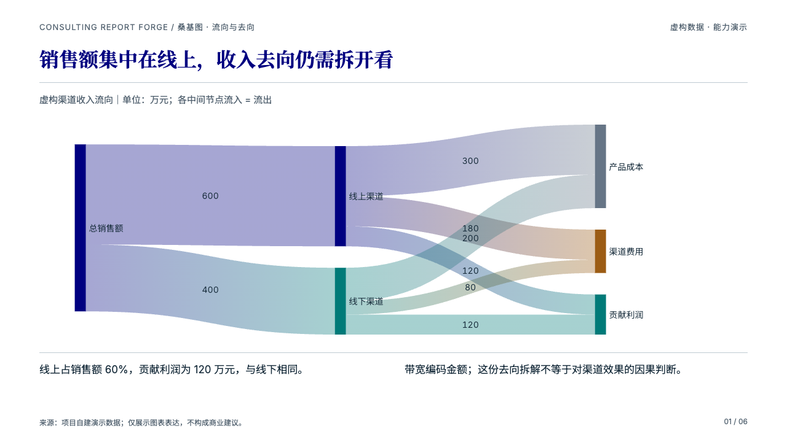](docs/showcase/chart-sankey.png) | [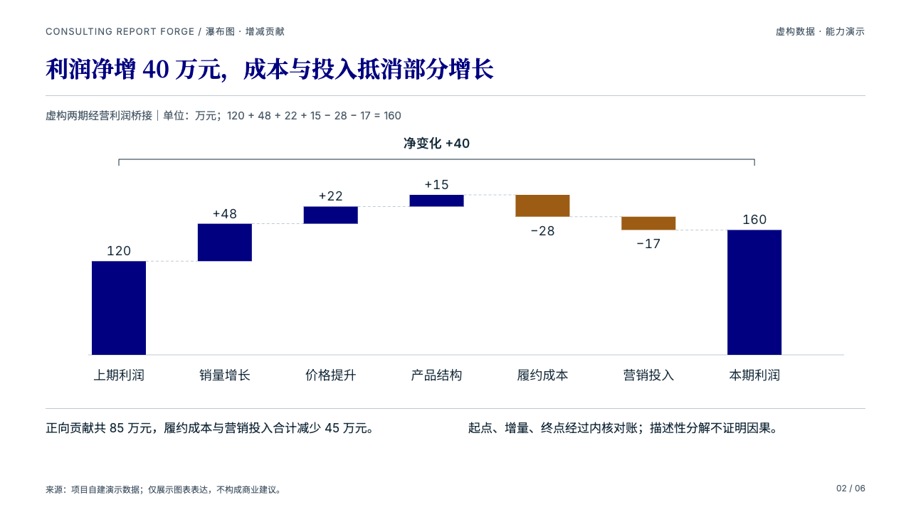](docs/showcase/chart-waterfall.png) |

| Mekko · 规模与结构 | 热力矩阵 · 条件与敏感性 |
|---|---|
| [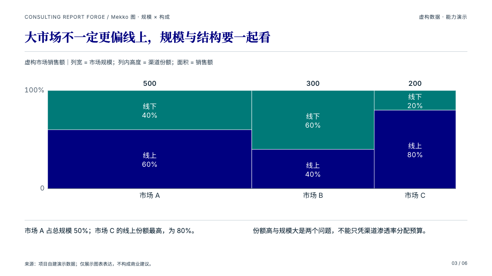](docs/showcase/chart-mekko.png) | [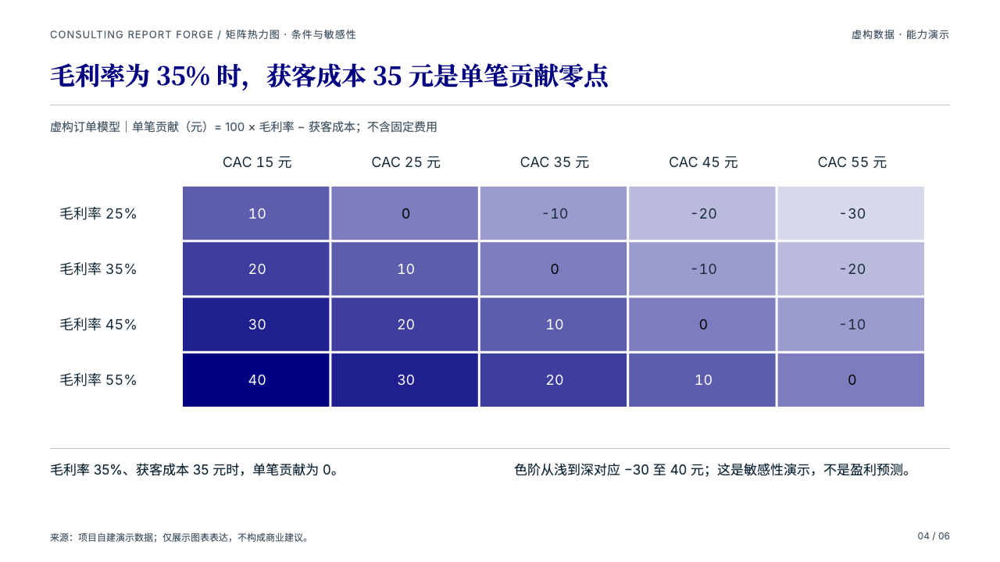](docs/showcase/chart-heatmap.png) |

| 哑铃 · 两期差距 | 子弹图 · 实际与目标 |
|---|---|
| [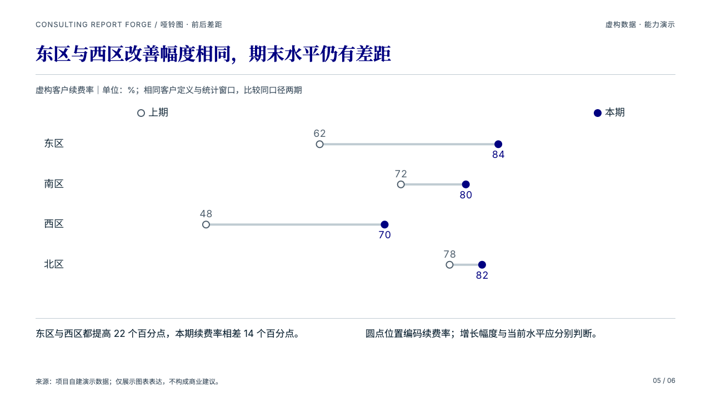](docs/showcase/chart-dumbbell.png) | [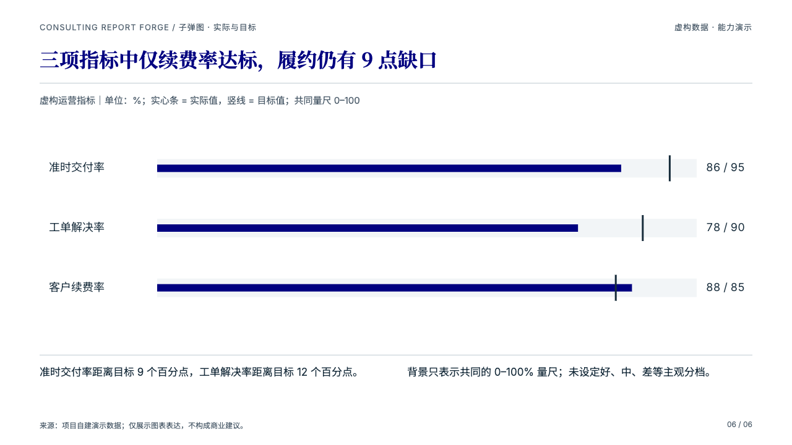](docs/showcase/chart-bullet.png) |

[表达选型指南](references/expression-guide.md) · [演示生成方式](docs/showcase/README.md)

</details>

### 07 · 交付与复核：便于分享，也便于继续更新

关键标题、主张、数字和来源统一维护。数据修订后，已绑定的图表标签与文字同步更新，减少多处手改造成的遗漏。你可以继续迭代分析和报告，并保留每次交付对应的依据。

验收同时覆盖 HTML 与 PDF。完成的审查可以归档；后续修订时，同一审查者已看过且证据未变的页面可复用，变化页和全篇判断仍须复核。自动检查负责内容一致性、溢出、字体与算术等工程问题，实际读图和独立审查负责论证与可读性。

## 报告样例

### 最新案例：中国 MES 市场——增长结构与交付约束

**20 页完整报告 · 17 页正文 · HTML/PDF 双媒介逐页检查 · 作者与独立实例复核**

这份报告从市场数据与访谈整理稿出发，将规模、增速、渗透率、厂商与交付材料组织成一条分析主线：**增长来自哪里 → 机会如何比较 → 交付受什么约束 → 下一步验证什么**。

其中，增长拆解解释增量来源，归一化比较区分规模与强度，敏感性分析检验假设，行动页连接研究与执行。以下均为最终验收版原页截图，展示分析如何进入实际成稿。

| 增长拆解 · 把增量讲清楚 | 竞争分析 · 把不同维度分开 |
|---|---|
| [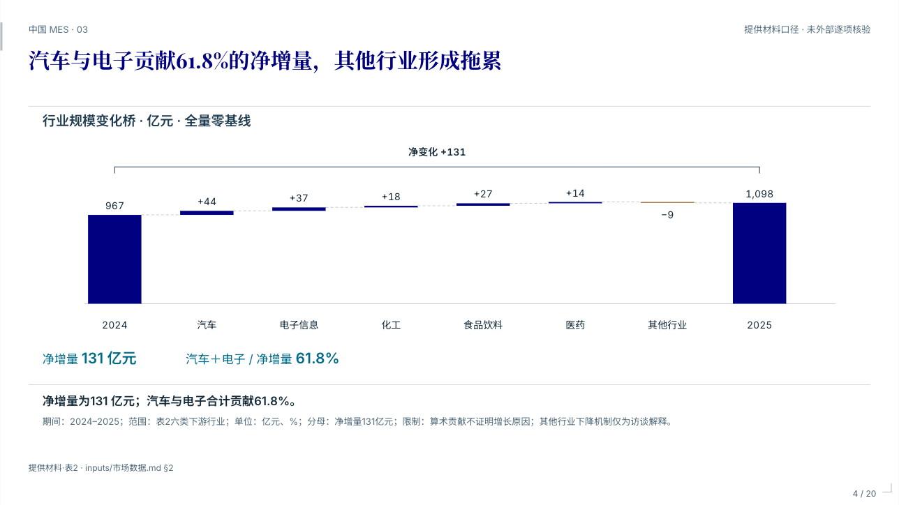](docs/showcase/mes-growth.png) | [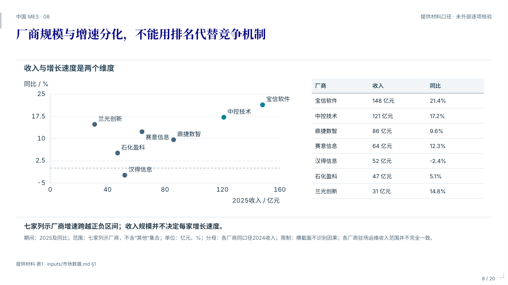](docs/showcase/mes-competition.png) |
| 从基期到本期，逐项解释谁在贡献、谁在拖累。 | 规模与增速同时看，避免只用一个排名代替竞争判断。 |

| 前后比较 · 水平与变化一起读 | 情景分析 · 让假设显形 |
|---|---|
| [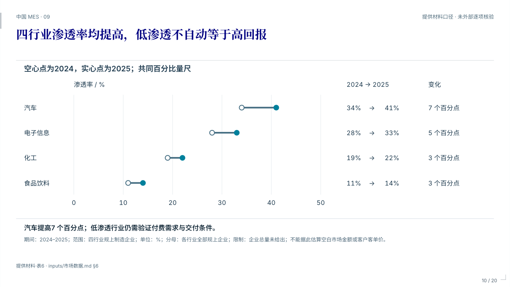](docs/showcase/mes-penetration.png) | [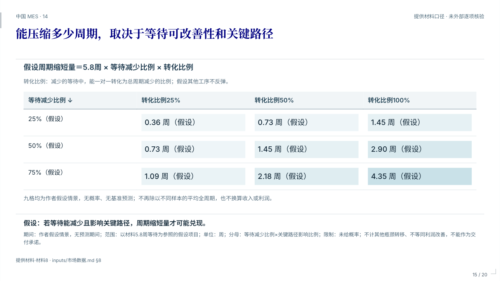](docs/showcase/mes-scenarios.png) |
| 同一量尺展示起点、终点与变化，保留分母。 | 展示结论如何随条件变化，明确区分假设与预测。 |

**从分析走向行动。** 报告最后将判断落到验证顺序、参与角色和继续／停止条件。

[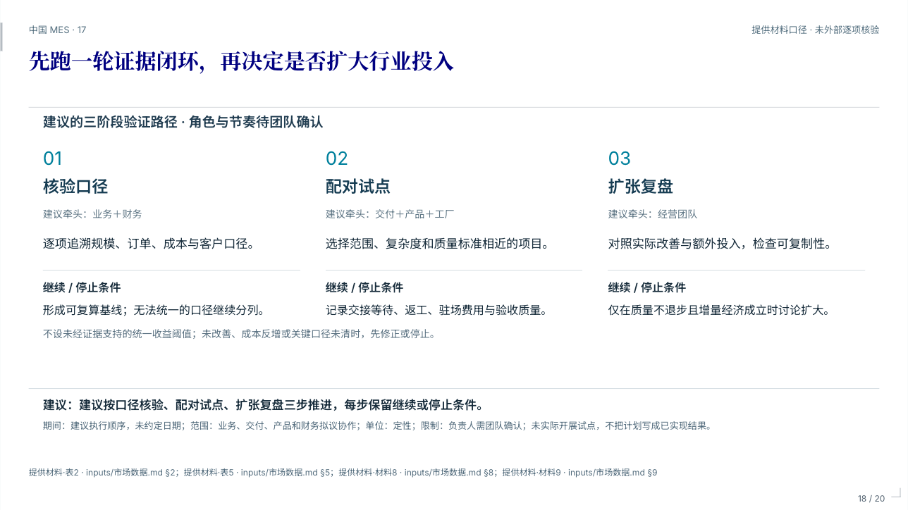](docs/showcase/mes-action.png)

> 本例用于展示技能的实际制稿表现。依据为用户提供的整理稿，未逐项外部核验；截图中的市场数字不作为当前市场事实认证。原始材料与完整报告保留本地，仓库公开精选截图和[验证分析](docs/mes-full-evaluation.md)。

<details>
<summary><strong>更多案例：TikTok 全球商业化</strong></summary>

另一份完整报告的选页，用于展示另一题材的表达。整册 15 页、12 页正文，完成过 HTML/PDF 验收；这些不是本次 MES 的页面。

| 市场优先级 | 指标区间 |
|---|---|
| [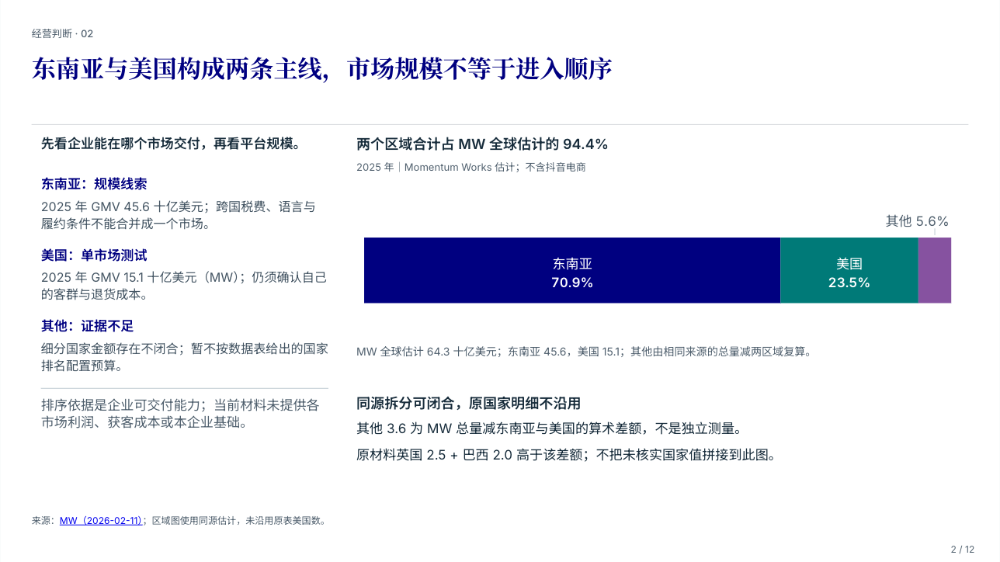](docs/showcase/report-priority.png) | [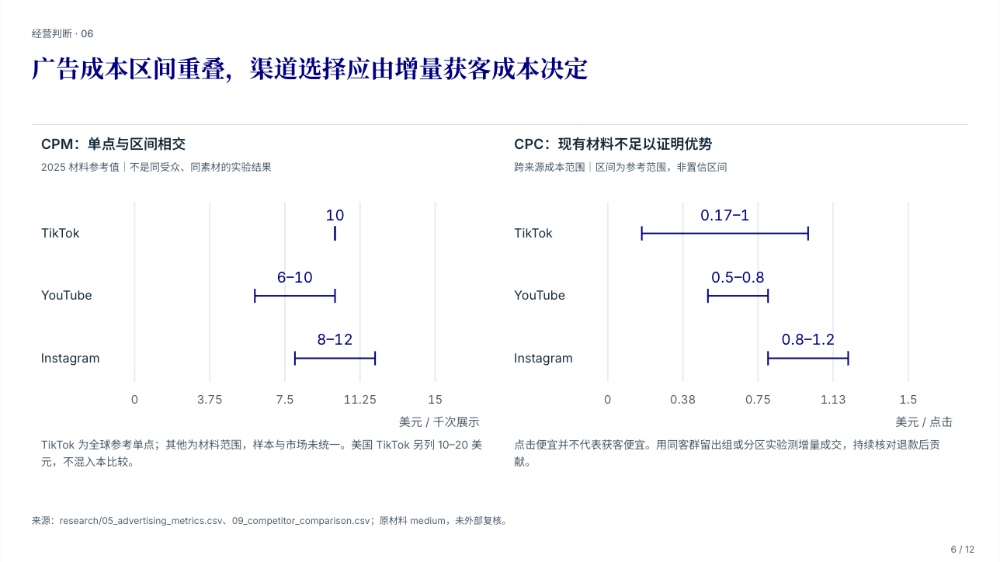](docs/showcase/report-ranges.png) |

| 敏感性分析 | 试验与投入门槛 |
|---|---|
| [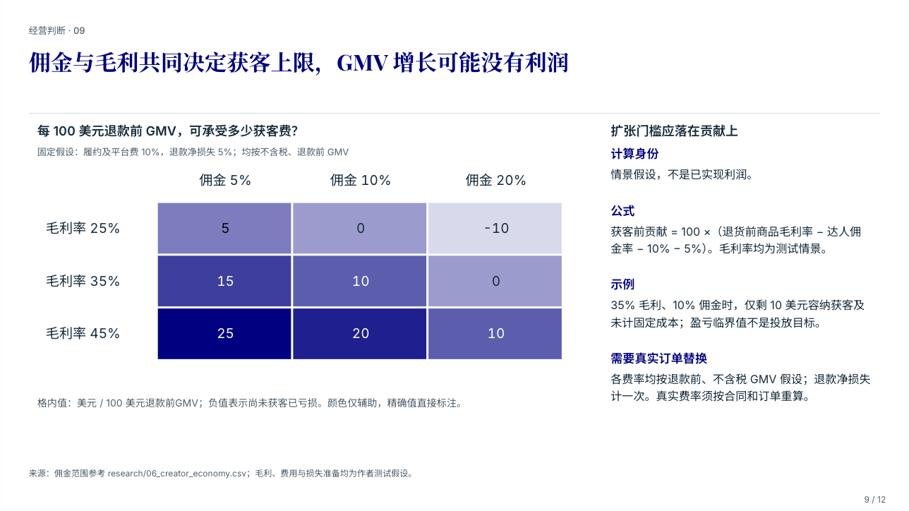](docs/showcase/report-sensitivity.png) | [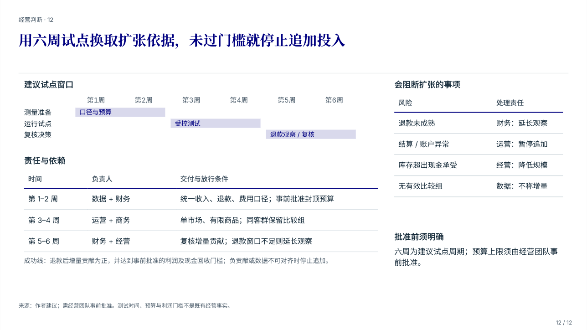](docs/showcase/report-action.png) |

图片均保留原有来源和时期，不作为当前市场建议。逐图出处见[样例说明](docs/showcase/README.md)。

</details>

## 你会拿到什么

**一套围绕业务问题形成的判断与证据，以及可以直接阅读、讨论和分享的报告。** 内容包括关键发现、分析依据、适用边界，以及任务需要的选项比较和行动安排。

| 交付物 | 用途 |
|---|---|
| **独立 HTML 报告** | 离线阅读、翻页、全屏、整册总览、页码链接；字体与图表随文件交付，成品内置同版 PDF 下载 |
| **同版 PDF** | 发送、打印与归档，关键图表和数据直接可见 |
| **可编辑制作底稿** | 内容蓝图、页面源稿和任务配置，便于继续修订 |
| **对应版本的检查记录** | 页面截图、自动审计及实际审查记录，用于复核和追溯 |

接收者只需要浏览器或 PDF 阅读器，无需安装制作工具。

## 适合哪些工作

| 场景 | 典型问题 | 建议提供 |
|---|---|---|
| 战略与市场研究 | 机会在哪里，先进入哪里？ | 市场数据、竞争资料、企业能力与约束 |
| 经营复盘 | 增长从哪里来，利润为何不同步？ | 分期收入、成本、产品与渠道明细 |
| 项目与投资分析 | 什么条件支持投入，哪些假设会改变判断？ | 财务数据、访谈、回报要求与情景假设 |
| 产品与增长 | 哪些客群或渠道值得扩大试验？ | 漏斗、留存、获客成本和实验结果 |
| 管理层汇报 | 要做什么选择，如何验证结果？ | 已确认结论、预算、里程碑和风险 |
| 研究稿重组 | 如何把长文变成易读的视觉报告？ | 完整文稿、原始表格、必须保留的限定 |

支持从材料开展分析、围绕问题开放研究，以及重组已确认内容。调研范围由任务确定，技能本身不附带付费数据源。

## 快速开始

### 1. 准备 Agent 与环境

使用能够读取文件、运行命令、查看实际图片的多模态 Agent。复杂或重大报告还需要实际独立复核实例。纯文本聊天窗口不能完成整套本地制稿与验收。

| 制作依赖 | 最低要求或用途 |
|---|---|
| Node.js + npm | Node.js 20+ |
| Python | 3.10+，用于字体子集 |
| Chrome / Playwright Chromium | 页面预览与 PDF 导出 |
| Poppler | `pdfinfo`、`pdffonts`、`pdftotext`，用于 PDF 检查 |

完整流程已在 macOS 验证；字体安装使用 POSIX shell，Windows 原生环境尚未验证，可在 WSL 中准备依赖。

### 2. 安装完整技能

```sh
git clone https://github.com/ZeroxZhang/consulting-report-forge.git
cd consulting-report-forge
npm ci
npm run setup-fonts
```

将整个仓库接入 Agent 的技能目录，或在任务中让 Agent 读取仓库中的 [SKILL.md](SKILL.md)。不要只复制入口文件，脚本、字体、模板与参考文档均为运行所需。

没有 Chrome 时可执行 `npx playwright install chromium`，并设置 `CHROME_CHANNEL=chromium`。完整步骤见[安装与环境](references/static-html-pdf.md#安装与环境)。

### 3. 给它一份清楚的任务

```text
使用 consulting-report-forge 制作一份经营分析报告。

读者：企业经营团队。
问题：未来两个季度，哪些市场与渠道值得优先投入？
材料：./research/ 中的原始数据、研究文档和访谈。
必须回答：增长来源、机会与约束、候选路径、下一步验证。
调研范围：先分析已有材料；允许使用可访问的公开来源补充深度调研。
分析要求：选择适合问题的商业框架，完成必要数据分析与情景测算；
          保留来源与口径，区分事实、估计、假设和建议。
协作要求：按缺口启用研究、建模或行业分析 Agent；复杂判断独立复核。
交付：中文、16:9、阅读型 HTML + 同版 PDF。
工作目录：./renders/market-priority/。

请形成总判断与 storyline，按技能流程完成研究、分析、制稿与交付。
```

提供业务口径、预算和停止条件会提高建议的针对性。页数和图型可交给证据决定；若需要先审蓝图或样张，在任务中明确阶段评审要求。

<details>
<summary><strong>已有安装：更新技能</strong></summary>

先妥善保存自己的修改，再在技能目录执行：

```sh
git pull --ff-only
npm ci
```

任务统一从蓝图模板开始，由编译器生成页面记录。多个 Agent 若通过软链接使用同一目录，只需更新该目录。

</details>

## 文档与验证

**已经完成的验证：** 工程与浏览器回归、六页合成任务实际制作、20 页 MES 同材料完整报告，以及单页修订后的审查复用。验证证明这些任务和机制可执行，不代表所有题材与模型上的质量或速度保证。

| 想进一步了解 | 文档 |
|---|---|
| 整套制作流程 | [技能入口](SKILL.md) · [HTML/PDF制作与交付](references/static-html-pdf.md) |
| 方法、故事线与专家协作 | [分析方法](references/analysis-methods.md) · [咨询叙事](references/consulting-storyline.md) · [协作协议](references/collaboration.md) |
| 内容一致性与来源 | [内容制作](references/content-authoring.md) · [证据身份](references/evidence-ledger.md) |
| 页面质量与后续修订 | [视觉验收](references/visual-qa.md) · [审查复用](references/review-reuse.md) |
| 实际验证的范围与局限 | [升级验证](docs/upgrade-validation.md) · [MES案例分析](docs/mes-full-evaluation.md) |
| 图片出处与复现 | [展示素材说明](docs/showcase/README.md) · [行为评估任务](evals/README.md) |

<details>
<summary><strong>维护者：运行检查</strong></summary>

准备好制作依赖后执行：

```sh
npm test                     # 计算、合同、兼容性与审查复用
npm run test:render          # 浏览器布局及瀑布绑定回归
npm run test:upgrade-render  # HTML/PDF内容绑定集成与反例
```

字体缓存专项为 `.font-venv/bin/python scripts/test_font_cache.py`。测试各有范围，具体报告仍需完成自己的最终验收。

</details>

## 使用前需要知道

- **输出 HTML + PDF，暂不输出可编辑 PPT/PPTX。** 它是由 Agent 执行的技能和本地工具链，没有独立在线编辑器。
- **质量取决于材料、模型与复核。** 来源记录和自动检查不能替代外部事实核验或专业判断；无法完成必要验收时必须说明状态。
- **用时随任务变化。** 研究、建模、长篇制作和独立复核会消耗时间与 token，不承诺固定分钟数或提速比例。
- **材料由你掌控。** `research/` 与 `renders/` 默认被 Git 忽略；公开展示前自行检查内容与来源授权。是否向模型或外部工具传输材料，取决于所用 Agent 与工具配置。

## 参与改进

欢迎在 [Issues](https://github.com/ZeroxZhang/consulting-report-forge/issues) 提交真实制稿问题与建议。附上最小复现、预期效果、实际截图和相关审计输出，先移除私人数据。如果这个技能对你有帮助，欢迎 Star，方便关注后续迭代。

## 许可与致谢

原创代码、技能说明与原创演示素材采用 **[Apache License 2.0](LICENSE)**。运行时基于作者的 [Consulting Deck Skill · Concise](https://github.com/ZeroxZhang/consultancy_charts_concise/tree/main/consulting_deck_skill_concise) 重组；字体保留 SIL Open Font License，第三方组件、材料和商标遵循各自权利与许可。

[NOTICE](NOTICE) · [第三方说明](THIRD_PARTY_NOTICES.md)
