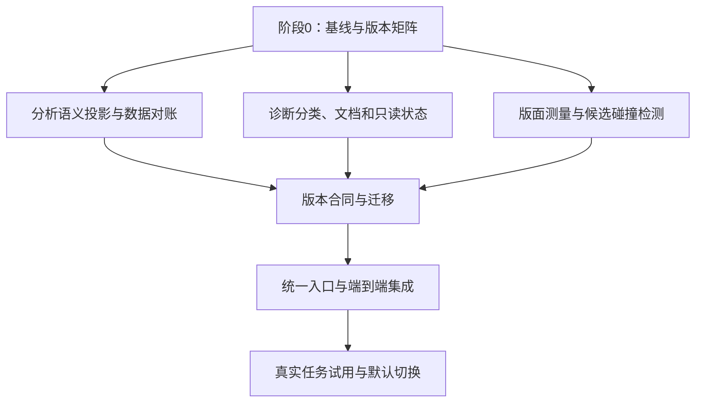

# consulting-report-forge 升级规划

状态：2026-09-26 本机 1.5.0 升级完成。严格合同、多页参考资料、细线策略、统一入口、任务锁与审查包已集成；定量研究、定性策略节选、已确认内容重排三类实际验收完成，新任务默认切换 task3。见 [R1 实施记录](upgrade-r1-validation.md)、[R2 验证记录](upgrade-r2-validation.md)、[第三批集成记录](upgrade-r3-validation.md)和[最终完成记录](upgrade-r4-completion.md)。README 与 onepage 已更新，仓库集成及远程同步以 Git 记录为准。原基线：运行时 1.4.0，Git `6c5f1e3`；真源为 `/Volumes/Out/my_own_skills/consulting-report-forge`。

本规划依据实际代码、29页AI生物制药报告的返工与审查记录，以及两项独立专项复核。原规划阶段只创建文档，未改动技能或原报告；下文描述目标方案，实际完成项以分批实施及最终完成记录为准，未启用字段与版本仍为建议。

## 1. 升级目标与需要保留的逻辑

目标是减少无益返工、提前发现阅读问题、补齐前置分析签名覆盖，并降低文件与状态维护成本。优先解决可靠性，再改善操作效率；不以减少审查步骤或降低判据来制造提速。

必须保留六项原则：

1. 蓝图仍是内容权威，`pages.json`、图表输入清单、审查范围均由它派生；不增加需要人工双写的内容副本。
2. 事实、估计、预测、假设和建议分开；来源、单位、分母、样本、模型及限制可追踪。
3. 研究—分析—叙事—代表页—完整制作—双媒介验收—真实审查—打包的顺序保持。
4. 工程检查不能代替事实核验、专业判断或实际读图；自动化只能准备审查材料，不能代签 ready/PASS。
5. 复杂或重大任务的实际独立复核、作者/独立身份隔离、未决重大问题拦截继续保留。
6. 旧报告按旧合同验证；新标准不得悄然改写旧签署、旧快照或已交付文件。

## 2. 先校正问题范围

|实际发现|不能夸大的地方|升级落点|
|前置分析摘要不自动覆盖 `slides.exhibit`、页面标题和侧栏中的实质论断|现有附件哈希、外部指标JSON pointer对账、最终蓝图及HTML/PDF摘要都已存在；并非整条链没有保护|补齐前置分析投影和展示数据引用，不另造全部数据机制|
|静态自绘SVG和自定义HTML的碰撞覆盖不足|当前已有部分图表、注释、对齐与来源区域检查；不能称完全没有碰撞能力|统一测量入口，明确覆盖范围，扩大真实遮挡检测|
|浅色分隔线被误判；已加载数字字体被误称系统回退；参考资料必须一页|彩色装饰顶线确实符合现行禁止政策；要区分检测错误与政策取舍|修误报和诊断分类；版本化调整风格、字体角色及参考资料块规则|
|多个文件与流程入口造成维护负担|iteration/smoke/acceptance、快照与逐页审查复用已经存在|提供统一操作入口，复用现有实现|
|结构清单、重复、连续布局等提示重复|这些当前已是诊断，不是强制图型/布局配额|归并问题、给出定位与行动建议，不再次“降级”|

维护文档也存在版本漂移：`docs/maintainer-contracts.md`仍把schema2写成当前入口，而SKILL、实际模板和生产流程使用schema3/task2。这应在第一轮修订，避免维护者按照旧说明设计兼容方案。

## 3. 优先级与工作包

P0＝影响证据或阅读可靠性；P1＝高频返工与执行成本；P2＝在前两者稳定后优化。优先级不等于所有工作必须串行。

|工作包|优先级|主要交付|主要依赖|
|A 基线与合同清单|P0|真实问题夹具、旧新版本矩阵、现有行为基线、阶段计时|无|
|B 分析签名与数据依赖|P0|自动语义投影、展示值与模型输出对账、失效原因、迁移草稿|A；最终接入F|
|C 版面测量与遮挡检查|P0|自定义HTML/SVG测量、跨区碰撞、覆盖报告、局部证据图|A；规则启用依赖D和F|
|D 规则与诊断改进|P1|字体分类、细线误报修复、多页参考资料、重复告警归并|A；多页正式启用依赖F|
|E 操作入口与状态管理|P1|只读状态、创建骨架、下一步提示、增量检查与审查包准备|A；写入/迁移能力等B/D/F稳定|
|F 版本、迁移与发布|P0贯穿|版本化策略、新旧读取分流、端到端验收、灰度与回滚|A建立；B/C/D共同接入|
|G 代表页与效率优化|P2|高风险页推荐、可读审查工作台、基于记录的效率评估|C/E已有稳定数据|

## 4. 五阶段路线

### 阶段0：固定基线，先让问题可复现

做什么：

- 保存当前版本及现有测试结果；把本次失败整理成最小HTML/CSS/SVG夹具，包含失败和正确对照。
- 不直接拿已修复的 `page.css`重放旧问题；有历史源稿则保存原稿，没有则标明是按证据重建的最小复现。
- 明确每种现有合同的组合，以及哪些文件产生、验证、迁移它。
- 记录阶段起止、返工原因、检查次数；不可得的token数据记未知。

退出条件：能够重现前置签名未覆盖exhibit、浅色线误判、字体分类错误、参考页限制和密表/标签遮挡；现有测试基线有实际结果。不能把计划中要跑的检查写成已通过。

回滚：没有生产行为变化；夹具与文档可独立保留。

### 阶段1：先交付低耦合改进

做什么：

- 统一当前版本说明，将历史版本规则移入明确的兼容维护段落。
- 新增只读“状态/诊断摘要”：哪一步缺材料、哪项审查过期、下一条有效操作是什么。
- 将同一问题在HTML/打印中的结果归为一个问题、两个观测；保留各自坐标与证据。
- 区分字体未加载、缺字、真实系统回退和字体角色不符；不直接放宽字体允许范围。
- 准备新策略下的结构细线识别和连续多页参考资料块，先作为候选能力，不改变旧合同的有效规则。

退出条件：相同诊断不要求重复写理由；报告问题仍能定位到每种媒介；旧CLI参数、旧快照和旧规则结果不被静默改变。只读状态命令不得写入任务文件。

可独立收益：即使后续升级暂停，这一阶段也能减少误诊和维护混乱。

### 阶段2：并行修两类核心缺口

**B线：分析可信度。**

- 从权威蓝图派生可审的语义投影：数据值、单位、期间、样本/分母、分类编码、下界/约数、模型和来源引用。
- 页面标题、`proves`、侧栏中的实质判断引用主张，或进入明确的展示论断集合。
- 优先复用现有 `metrics.external`、JSON pointer与artifact血缘；展示层引用数据，不另手抄一份数值。
- 将字体、普通间距、非语义坐标排除出分析签名；比例尺、颜色所代表的类别和编码含义仍属于分析。
- 自定义展品未完成语义/样式分离时，保守地将整个exhibit纳入分析敏感范围，并提示可能发生额外重审；不能默默漏签。
- 首版只做“分析投影变动→前置审查失效+精确差异清单”。不立即开发复杂的逐主张自动签署继承。

**C线：版面可靠性。**

- 收集实际文字行框、表格可见末行、SVG变换/裁剪、来源区域与绘制关系；补齐自定义布局的区域映射。
- 优先识别表格与页脚冲突、同层文字重叠、关键字符被裁切或遮挡；不给全部对象简单做外接框相交后就判失败。
- 排除正常的嵌套包含、柱内标签等合法关系；旋转、透明、复杂路径等低确定情况保留待审。
- 新检测先“只记录、不拦截”，与人工标注结果对比。未覆盖的canvas/位图/特殊图形明确标记，不能输出全页“无碰撞”。

退出条件：B线的数值/分母/编码/论断变异测试可触发失效；已完成语义/样式分离的展品，纯排版不得触发分析失效；未分离的custom展品按保守规则失效，并明确提示额外重审原因。C线能稳定发现本次五类版面问题，合法对照不被误拦。各类检测的漏报、误报与耗时有实际记录。

并行边界：B负责语义与依赖，C负责测量；二者共享页面/对象ID，不互相修改判据。最终同时通过统一QA与F版本合同接入。

### 阶段3：集成生产入口与兼容迁移

做什么：

- 增加统一入口，内部调用现有编译、装配、QA、复用、聚合和打包程序，保留旧CLI；不复制第二套判据。
- 任务状态由文件及摘要推导，辅助状态文件只是缓存；内容生成不能覆盖任务配置和审查记录。
- 使用临时输出、校验后原子替换；失败保留上一版有效产物。并发操作需要任务锁，避免主笔和审查者互相覆盖。
- 自动准备代表页、受影响页截图、差异和审查草稿；审查草稿保持incomplete，不自动填写通过。
- 允许一个连续的多页参考资料块：跨页来源ID唯一、顺序正确、总数/节选说明真实、无裁切或漏项。
- 完成新合同能力门与迁移工具；缺乏映射的旧图表列为待补，不能自动猜测单位、分母或证据身份。

退出条件：当前29页报告的副本可完整走通“迁移→重新审查→编译→验收→复用→归档→打包”；迁移不改原报告；缺审查和过期审查仍会被拒绝。单页改动、共享字体改动和数值改动触发各自正确的后续动作。

### 阶段4：小范围试用，再切换新任务默认值

做什么：

- 先用固定材料案例试用新合同，再用至少三类真实任务验证：高密度定量研究、定性策略、已确认内容重排。
- 抽查新旧结果差异，关注新增误拦、漏检和额外维护成本；不只看测试是否全绿。
- 新测量器仅将证据充分、误报已控制的问题升为硬检查；不确定项继续人工判断。
- 通过后，将严格新合同用于新建任务；历史任务继续明确保留旧身份或选择迁移。

发布条件：关键变异测试全过；无未解决major/blocking；旧快照可验证与迁移；三类任务均完成实际验收。若只测试了AI生物制药一例，只能称该案例通过，不能宣称通用质量或效率已提高。

回滚条件：出现历史证据无法读取、错误继承审查、重大漏检或新增误拦明显妨碍制作。关闭候选新策略或恢复上一运行时；保留新任务目录，不把新合同篡改成旧合同强行打包。

## 5. 耦合关系：哪些可分开，哪些必须一起改

|变更|必须一起核对的组件|可以先独立做的部分|
|分析签名|分析合同、前置审查、task能力门、编译/装配、最终review、快照/复用、打包|字段覆盖诊断、差分报告、只读依赖图|
|字体角色|字体配置、字体打包清单、浏览器字体审计、PDF/离线检查|错误分类与措辞修正|
|多页参考资料|bookend生成/校验、正文页号映射、PDF提取/链接、交付检查、测试|设计新reference block合同和夹具|
|诊断ID与归并|QA输出、warning处置、review摘要、快照和历史读取|人类可读的归并展示，保留旧底层字符串|
|碰撞检查|统一page probe、屏幕/打印测量、覆盖声明、规则版本、人工审查|影子检测与标注集|
|统一生产入口|所有现有操作的入参、返回状态、文件归属与失败恢复|只读status/next、骨架生成、检查材料整理|

同一行中的生产合同改动应作为一个集成变更单元提交验证，避免“先改签名、后补快照”或“先放宽字体、后补打包”。代码可分工，发布不能割裂。

## 6. 兼容性与版本建议

当前新制作组合为 blueprint schema3 / task2 / pages4 / analysis-review1 / final-review4；历史路径继续由既有适配器处理。维护阶段以实际支持组合建表，不能把任意历史版本混搭。

建议把发布拆成三个能力层，而不是一次覆盖现版：

- **R1：兼容改进。** 文档、诊断展示、只读操作与回归夹具，保持已有合同语义。
- **R2：严格合同候选。** 新任务显式启用；新运行时可读旧、新两类；旧运行时必须拒绝新合同，不能忽略新增字段后误判通过。
- **R3：新任务默认切换。** 经过真实任务验证后启用；旧稿不自动迁移。

具体门控建议：新增task3作为新能力入口，因为1.4.0明确拒绝不支持的task版本，仅加一个可被忽略的profile字段不够。前置审查建议升v2以声明摘要算法，最终review建议升v5以承载新语义和诊断身份；blueprint/pages只有结构无法兼容扩展时才升版，不为整齐而全部升版。该组合是实施前必须签定的设计决定，不是现有事实。

要特别检查代码中所有 `task.version === 2`、固定review版本和schema配套分支，改为显式能力映射；不能通过简单的 `>=2`猜测未来语义。

|使用情形|预期行为|
|旧运行时＋旧任务/快照|保持原行为|
|新运行时＋旧任务/快照|按原版本算法验证，清楚标明旧覆盖范围；可提示迁移，不补签|
|新运行时＋新合同|执行新语义投影、规则版本和审查要求|
|旧运行时＋新合同|明确拒绝，提示所需运行时；不得静默降级|
|旧任务迁移|在新目录生成新合同、差异与incomplete草稿，保留原字节与原签署|
|新运行时回滚|新产物仍可离线阅读；继续制作须保留支持它的运行时或等待修复，不转换出伪旧签署|

新的有效规则版本、字体角色配置和检测器版本应写入可验证的审计/复用指纹。历史audit不原地补字段，不重算旧签名冒充新标准。视觉复用仍使用现有精确证据比较机制；当前规则适用性和全局分析判断要本轮确认。

## 7. 对升级前后“变化”的统一处理

|变化|前置分析|视觉/工程|实际审查|
|图表数值、分母、期间、来源内容、编码、模型代码变化|失效，输出字段与依赖差异|重新编译及最终验收|重审变化分析与全局综合；受影响页重新读图|
|标题或侧栏实质结论变化|失效|受影响页重新生成|不能只当文案排版修改|
|纯间距、字体或非语义颜色变化|已分离语义/样式且投影不变时保持；未分离custom按保守规则处理|受影响页；共享字体/样式可能扩展全册|复看实际变化的两媒介证据|
|页序或来源页块变化|看语义是否变化|页号/导航/引用和相关证据失效|按现有复用差异确定覆盖，不能仅凭视觉相近继承|
|规则版本变化|分析规则变则按合同失效|新规则重新评估；显示相同不表示规则相同|重新处置受影响问题与全局判断|
|仅目录迁移|内容未变则不失效|重定位相对路径并核原字节|按现有可迁移快照机制验证|

## 8. 验收矩阵与发布门槛

利用现有测试体系，不另建一套脱离生产链的测试框架。

|类别|最低必须覆盖|
|签名/数据|只改exhibit小数、热力格、下界符号、分母、侧栏结论；模型输出变而显示舍入不变；显示值与external不符|
|排版误报/漏报|四类密表压页脚、极坐标标签重叠、负号被挡、SVG裁切；合法行内强调、嵌套容器、柱内标签、旋转不相交|
|字体与风格|包内数字字体合法角色、真实系统回退、缺字、字重错误；浅色细线、彩色装饰线、数据条和伪元素|
|参考资料|一页/多页、重复ID、漏ID、错误总数、非连续块、长链接裁切、PDF漏项、节选说明|
|生命周期|重复执行不重置审查；中断恢复；并发写入；部分输出失败；过期摘要；未审草稿不能打包|
|兼容/迁移|受支持旧组合、新合同旧读取器拒绝、移动快照、递归复用、只改PDF、审查者更换、旧问题不丢失|
|端到端|研究→综合→前置签署→编译→装配→acceptance→真实复审→聚合→快照→局部修订复用→打包|

现有命令继续承担主要回归：`npm test`、`npm run test:render`、`npm run test:upgrade-render`；新增用例扩展现有analysis、review-reuse、layout-policy、report-regressions与字体测试。测试通过不替代真实HTML/PDF查看。

检测器发布评估应按HTML表格、普通SVG、旋转文本、来源区分别统计误报/漏报和耗时。已知重大缺陷及负向变异测试必须全部被捕获，合法固定对照不能新增硬失败；这是固定测试集门槛，不意味着现实任务零漏检。一般统计阈值在基线测量后确定，不先编造准确率。

效率记录至少包含：研究/制作/检查/返工耗时，操作次数，重复诊断数，手工维护文件数，全册重导次数，未决问题数。外部调研与制作工具耗时分开；比较时固定材料、环境和模型，报告样本量与局限。没有对照测量前不承诺百分比提速。

## 9. 实施边界与暂缓事项

首轮不做：自动替作者形成投资结论、任意布局自动美化、全项目目录扫描入签名、用低清截图相似度替代审查、逐主张自动代签继承、以任意ignoreErrors绕过质量底线，也不趁机新增PPTX等输出路线。

生产期新建任务使用一个明确入口，兼容分支留给工具和维护文档，避免让作者反复选择schema。实施完成后只在真源维护；Agent入口按项目规定用dbs-bridge同步/检查，不复制第二份skill。

## 10. 本规划的事实依据

技能实现：`scripts/analysis_contract.cjs`、`analysis_artifacts.cjs`、`analysis_review_contract.cjs`、`report_contract.cjs`、`review_contract.cjs`、`prepare_review_reuse.cjs`、`browser_visual_policy.cjs`、`browser_font_audit.cjs`、`check_bookends.cjs`、`page_probe.cjs`、`qa_deck.cjs`及现有测试。

过程材料：本工作目录 `report/work-log.md`、`report/independent-analysis-findings.md`、`report/smoke/audit.json`、`report/renders/author.json`、`report/renders/independent-notes.md`。

专项复核：
- 数据与兼容性审阅（本地历史底稿 `report/upgrade-compatibility-review.md`，不随仓库公开）
- QA与规则审阅（本地历史底稿 `report/upgrade-qa-review.md`，不随仓库公开）

原规划轮完成的是代码与材料核查、规划和独立专项意见。当时尚未实施上述升级；后续实施与实际验证另记于 R1 实施记录，不能把后续结果倒写为规划时已经通过。

规划一致性复核已完成：修正了未分离custom展品的保守失效规则与“纯排版不触发失效”验收条件之间的冲突；版本候选、迁移和默认切换边界经独立实例复核。
