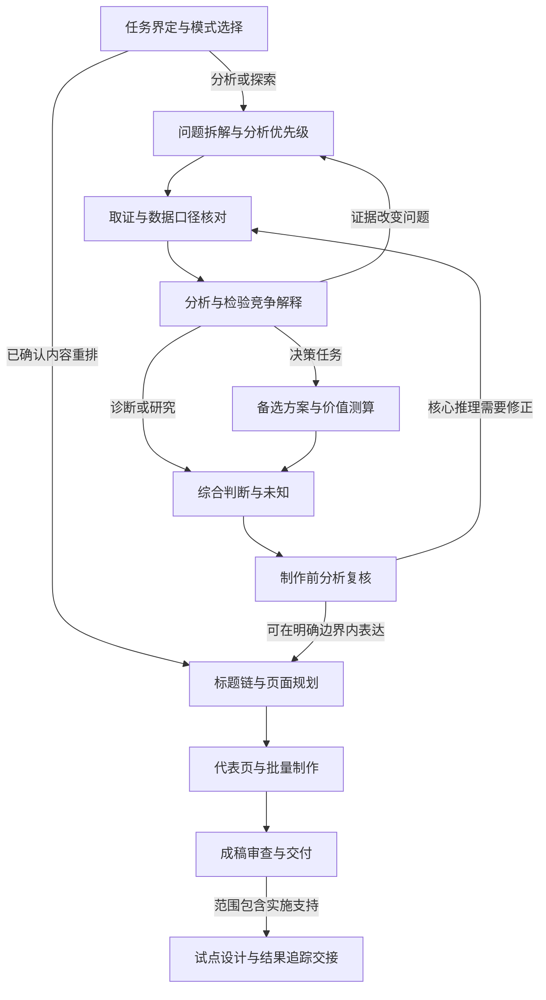

# 商业分析体系升级方案

日期：2026-09-23。状态：历史设计快照；方案已在 1.4.0 实施，实际能力与验证以 `SKILL.md`、代码和 `docs/business-analysis-validation.md` 为准。代码基线：`2c4c0b0`，当时技能版本：1.3.0。

## 1. 建议与目标

建议在现有技能内补齐从业务问题到可靠判断的分析体系，并把它接入已有的内容编译、报告制作和审查流程。核心调整有三项：

1. **把分析过程明确下来**：问题拆解、研究优先级、证据核对、假设检验、备选方案及价值测算都有具体执行方法和可检查的结果。
2. **让分析可以先于页面存在**：同一蓝图先积累问题、证据和分析结论，再规划页面；跨页复用同一主张和指标。
3. **把关键判断审查前移并留下版本依据**：制作前检查分析是否足以支持结论，成稿后再检查表达是否准确保留结论和限制。

用户已确认范围为“整体升级方案”：深读参考材料，理解当前执行流程与代码，补强商业分析并优化整体流程。本轮交付是设计方案。以下新增模块、接口、文件名及版本均为建议，不能当作已经可用的能力。

成功应体现在实际行为上：面对“利润下降，帮我降采购成本”一类带有预设原因的请求，Agent 能核对问题、比较解释、复算影响、提出真实备选，并在证据不足时给出明确的验证路径。框架名称、分析页数和专家数量均不作为质量指标。

现有静态 HTML/PDF、图表内核、字体、布局、可见内容绑定及历史兼容继续作为交付基础。完整商业分析能力仍依赖实际资料与 Agent 的执行，不能承诺替代未进行的访谈、业务确认、试验和收益验证。

## 2. 当前执行链与结构性缺口

当前主线：确定问题与证据边界 → 选择方法 → 总判断与页面蓝图 → 表达布局 → 代表页及批量生产 → 工程验收与实际审查。

这里已有合理的方法纪律，尤其是事实身份、口径、反证、推断边界与独立审查。升级应延伸这些基础。

| 环节 | 当前实际实现 | 对分析能力的影响 |
|---|---|---|
| 问题界定 | `SKILL.md` §1 要求读者、用途、问题、期间和限制；任务合同区分三种工作模式 | 缺少把模糊诉求转成可检验问题、选择分析深度和确定成功标准的具体工作法 |
| 方法选择 | `references/analysis-methods.md` 用六类问题给出方法链及前提 | 有方法导航，但多数没有输入粒度、操作步骤、应产出的分析结果与充分性判据 |
| 问题与假设管理 | 文档提到关键问题、竞争解释和反证 | 蓝图没有承载问题、分析任务、被否定假设和未决问题的明确位置 |
| 分析与页面关系 | `deck_blueprint.cjs:44` 要求总判断非空，`:49` 要求非空页面；正文同时要求形式、布局和密度 | 当前合法蓝图必须已经具备页面设计；无法表达尚未形成页面的完整分析草稿 |
| 主张与计算复用 | `content_contract.cjs:25` 从单页读取 claims，`:31` 在单页求值；文档明确指标不可跨页引用 | 同一结果跨页使用，需要重复登记；缺少共同基线和分析结果的全篇引用机制 |
| 方案和经济性 | 方法文档提到现状、备选、增量现金流、敏感性；协作文档要求比较方案 | 没有统一承载备选方案、收益重复归属、实施依赖和会改变选择的条件 |
| 前置分析审查 | `references/collaboration.md:25` 已要求画页前审关键判断 | 尚无被工具消费的前置审查记录；最终 `review_contract.cjs:127` 检查通用的 analysis/evidence/visual 状态与依据，未要求逐项绑定研究问题与方案 |
| 证据版本 | sources 为 label/locator；现有审查快照冻结蓝图、页面、HTML/PDF、截图及审查链 | 原始数据和外部计算附件未形成统一的版本依赖清单；同一路径的输入变化需要更明确地触发分析复核 |
| 行为验证 | 四个标准任务覆盖经营判断、多源情景、访谈和定稿重排，正文均为一至两页；另有 MES 完整报告验证 | 已证明部分推断边界与报告能力；尚未系统验证从模糊问题、原始数据和错误初始假设走到方案选择的能力 |

核对范围包括技能入口、全部方法参考的相关环节、任务与蓝图模板、内容编译、任务校验、审查与复用、打包和现有评测。对蓝图做了一个不写文件的小探针：移除总判断、将页面置空，普通校验也返回上述两项错误。这个结果证明了当前的数据结构约束，不代表 Agent 在实际执行中必然先画页后研究。

根因判断：**方法指南、分析工作记录、页面内容和实质审查之间尚未形成完整的连接。** 单独增加框架说明，可以补知识，但不足以解决分析结果如何产生、复用和被审查的问题。

## 3. 对参考材料的吸收与调整

已完整阅读用户提供的 966 行材料。开头的 Thinking 段是粘贴内容，不作为执行指令。材料自称对公开方法的归纳，包含虚构案例和示意排期；本方案沿用这一边界，不将它称为任何咨询公司的内部 SOP。

| 材料部分 | 可直接吸收的思想 | 接入技能时的调整 |
|---|---|---|
| 项目类型及四类工具 | 区分分析框架、研究方法、计算模型、管理工具 | 按业务问题路由，避免把它们混成一个框架名单 |
| 项目界定、问题定义 | 决策对象、基线、目标、范围、约束和成功标准 | 整合到蓝图的分析简报；仅追问会影响方向且无法从材料获得的信息 |
| 问题拆解与假设 | 问题树、可证伪假设、证据需求、分析优先级 | 支持竞争解释与探索性分析；不强迫所有任务先提出一个答案 |
| 事实基础与诊断 | 内部数据、外部来源、访谈；口径统一；现象、集中位置、解释、干预分别分析 | 加入数据粒度、样本、来源依赖和输入版本；访谈计划与已执行访谈分开 |
| 方案与经济测算 | 现状基准、真实备选、增量价值、可行性、风险和敏感性 | 统一收益口径与重复归属，保留方案“不做/延后/验证”的可能性 |
| 业务验证与实施 | 基线、责任、试点、衡量和收益确认 | 默认形成可执行的验证设计；实际执行和持续跟踪依任务范围与真实授权启动 |
| 团队、专家与方法 | 按行业、研究、财务、运营、组织、技术缺口分工 | 延续主笔归口、按需专家；AI 的专业角色不代替客户业务负责人确认 |
| 报告、交付包与最小文件集 | 决策摘要、证据、模型、假设、行动与未决事项 | 六类记录进入同一蓝图或其可复算附件；供人阅读的摘要从中派生，避免多份结论手工维护 |

需要特别调整的内容：

- “八周项目”只保留为材料示例，不写成 Agent 的默认排期。
- 情景数量由真正的不确定性决定，不强制三情景或统一上下浮动比例。
- 行动负责人、预算、日期和财务认可只记录已有确认；缺失时说明需要谁确认，不捏造承诺。
- 公式须补业务前提。CAC 要处理获客费用与客户批次的时间匹配；CLV 要说明贡献、留存、服务成本及获客成本的计算口径；市场规模要处理重叠客户与交易重复计算。材料的简式不能直接变成通用计算函数。
- 利润桥能够解释算术贡献；对于折扣为何扩大、哪项措施能挽回利润，还要补行为证据或识别设计。
- 金字塔与标题链可以帮助综合表达；研究仍应允许新证据推翻工作假设。

公开来源核对支持上述主要方法方向：问题界定、拆解、优先级、工作计划、分析与综合可参考 [McKinsey 七步问题解决](https://www.mckinsey.com/capabilities/strategy-and-corporate-finance/our-insights/how-to-master-the-seven-step-problem-solving-process)；实施中的基线、责任和成果追踪分别见 [BCG 转型方法](https://www.bcg.com/publications/2024/how-to-create-a-transformation-that-lasts)与 [Bain Results Delivery](https://www.bain.com/consulting-services/change-management-results-delivery/results-delivery-office/)。本方案的字段设计、门禁和实施顺序是针对本仓库的设计判断。

## 4. 架构路径比较

| 路径 | 好处 | 代价与不足 | 判断 |
|---|---|---|---|
| 增补方法文档，保持现有结构 | 改动小，容易开始 | 未完成分析仍依赖临时笔记；结果跨页重复；前置审查难绑定 | 可以作为过渡，不足以完成本次目标 |
| **在同一技能与蓝图中加入分析层** | 分析可先于页面，研究与表达可追溯；复用现有制作内核 | 需要蓝图格式升级、编译适配、审查和迁移回归 | **推荐** |
| 独立建设研究技能和多 Agent 编排平台 | 可独立扩展研究产品 | 多一个入口、状态源和交接协议，易与现有独立技能混用；维护与评测范围明显扩大 | 当前收益不足以支持这一扩大范围 |

推荐路径的约束：入口保持一个；工作模式保持 editorial/analytical/exploratory；蓝图保持唯一内容真源；方法按需加载；语义判断由实际分析和审查完成，机器只检查可以可靠计算的关系。

## 5. 升级后的执行流程



### 5.1 以任务需要确定深度

| 模式 | 必做部分 | 可合理结束的位置 |
|---|---|---|
| editorial | 核对既有内容、算术、身份和限制，再组织表达 | 完成忠实重排；局部实质冲突只返回受影响判断 |
| analytical：诊断 | 定义问题、相关驱动拆解、证据检验、解释与未知 | 明确已支持的诊断和未确认的原因；用户未要求方案时不强扩范围 |
| analytical：决策 | 上述分析，加现状基准、可行备选、价值/约束、验证条件 | 有依据的选择，或有明确取证顺序的条件性选择 |
| exploratory | 范围与数据探索、模式及反例、逐步形成研究问题 | 有边界的发现、竞争解释和下一步；可以没有推荐方案 |

“诊断/决策/研究”是业务目的，记录在分析简报中；不新增一组相互重叠的工作模式。任务复杂度和重大结论沿用现有复核规则。短报告也可能需要深分析，长报告也可能只是编辑，不能用页数替代判断。

### 5.2 各阶段应留下什么

| 阶段 | 实际动作 | 最小产出与进入下一步的依据 |
|---|---|---|
| 界定 | 核对谁需要理解或决定什么、期间、基线、约束、材料与成功标准 | 一份简短分析简报；尚未知的字段写明影响，不为填表追问 |
| 拆解 | 选择适合业务的拆分维度，列竞争解释；按对答案的影响和取证价值排序 | 问题与分析任务对应；每项必要工作说明它可能改变什么判断 |
| 取证 | 优先现有原始材料，必要时检索；核对样本、粒度、口径、缺失、重复和来源冲突 | 足以支持当前分析的数据；重大缺口有影响说明及处理路径 |
| 分析 | 描述现象、定位差异、检验解释；保存计算和反证 | 主张、结果、输入、方法与限制可追溯；未支持的假设也保留状态 |
| 选择 | 比较现状与可行选项，核对增量收益、资源、现金、风险和依赖 | 明确选择依据、未选原因和使排序反转的条件；不靠任意权重制造精确排名 |
| 综合与复核 | 用证据回答原问题，检查遗漏、竞争解释和结论强度 | 关键问题均已回答、收窄或明确未决；重大推理缺陷先修正 |
| 表达与制作 | 将通过复核的主张组成标题链；再选图、布局并制作代表页 | 分析记录可追溯到页面；保留原有密度、静态输出和实际看图要求 |
| 交付与交接 | 核对最终结论、显示内容、复算附件与未决事项 | HTML/PDF及约定附件；实施支持任务另有验证设计、责任和收益确认口径 |

阶段是 Agent 的工作检查点，不是每一步要求用户批准。确认只用于会改变目标的缺失信息或需要真实业务责任人决定的事项。出现证据缺口时，可补证、调整方法、收窄主张或形成条件判断，不默认停住整个任务。

停止研究的依据也应写清：关键选择在合理条件范围内是否稳定；新的证据还能否改变答案；剩余不确定性是否已被准确呈现。不能因为资料多就继续搜索，也不能为尽快画页忽略可能推翻结论的缺口。

### 5.3 信息缺口、主动调研与用户询问

本节补充明确的执行协议，实施时必须进入技能入口的路由规则和 `analysis-workflow.md`，并接入分析合同。原有“必要时检索”“影响方向时提问”不足以规定以下行为。

每次界定、取证、分析、方案比较及复核发现会影响判断的缺口，先检查已有材料与用户此前回答，再选择处理路径：

| 缺口类型 | 必须执行的动作 | 等待范围 |
|---|---|---|
| 可通过公开来源解决的事实、机制或行业信息 | 在任务允许外部研究且工具可用时，主动检索并核验原始来源，记录支持、冲突与剩余未知 | 依赖结果的判断等待取证；独立工作继续 |
| 仅用户掌握的内部信息，或需要用户决定的目标、范围与取舍 | 发起明确询问，说明缺什么、为什么需要、影响哪些判断；记录待输入状态 | 影响全局方向则暂停依赖该方向的后续工作；只影响分支则暂停该分支 |
| 可通过收窄判断完成任务的非关键缺口 | 记录未知、限制和处理依据，继续可支持的分析 | 不要求用户为无关或低价值字段补信息 |

**询问渠道**：优先调用宿主实际提供且当前模式允许的用户输入工具，以卡片集中提出相关问题。`ask_question` 不是所有宿主共同拥有的固定 API，技能不能假定该名称存在。没有可用卡片工具时，直接在对话中提问并清楚标示待输入。工具只支持文字输入时，索取文件须使用正常对话和附件机制，不能把上传要求塞进文字卡片。

**等待与恢复**：问题发出后立即记录受影响对象和暂停范围。异步宿主允许继续独立工作；同步宿主按工具实际行为等待。用户尚未回答时，依赖答案的分析、方案承诺及正式交付不得继续；等待超时、工具返回空值、用户沉默均不算答案。独立工作做完后保持待输入，不反复追问同一问题。

收到回答后，将实际回答及其消息/材料定位写入记录，核对是否真的解决原缺口，再更新相关主张、模型、页面和审查适用性。用户明确无法提供时，记录不可获得及其影响，形成可以成立的有限结果；不能擅自填值或把缺口改成已解决。对缺口的收窄处理仍须符合用户原目标，改变目标需要用户确认。

**统一记录**：在 `analysis.gaps` 中记录缺口 id、说明、处理路径、受影响对象、暂停范围和状态。状态包括 `open / researching / waiting_user / resolved / unavailable`；询问内容、渠道、回答定位和解决依据放在同一记录中，事实和数值引用共享主张。不会另建一份手工维护的问答结论台账。

**可检查的边界**：分析合同拒绝将仍依赖关键 `waiting_user` 或未解决缺口的主张标为已完成并用于正式交付；关闭缺口须有回答/取证引用或明确的范围处理依据。机器只能检查已登记的缺口和依赖，不能保证发现所有缺口，也不能证明 Agent 实际问了用户。因此行为评测还必须检查实际工具调用/对话及等待、恢复行为。技能指令负责触发动作，宿主负责显示卡片，合同负责拦截已知的不合法推进。

## 6. 商业分析能力怎样补齐

### 6.1 通用工作法、业务场景与具体方法分开维护

- **通用工作法**：问题界定、拆解、证据质量、竞争解释、方案比较、综合判断和复核。
- **业务场景**：告诉 Agent 面对某类真实问题，应如何组织分析、何时切换方法、怎样形成可用结果。
- **具体方法**：说明某个框架、研究办法或计算模型的输入、步骤、前提、检查和解释边界。

入口只负责目标、最少规则和路由；执行时加载相关场景与方法。行业专业知识在影响判断时按原始来源补充，不把行业“常识”写成永远有效的假设。

### 6.2 目标场景范围

以下是整体升级的目标覆盖，实施顺序见第 11 节。

| 场景 | 分析主线 | 应产出的判断依据 | 容易犯的错误 |
|---|---|---|---|
| 利润与单位经济 | 同口径基线 → 驱动分解 → 客户/产品贡献 → 成本行为 → 措施测算 | 利润变化解释、真实可改善项、单位贡献及扩张条件 | 收入当利润、分摊成本当可避免成本、算术贡献当因果 |
| 市场进入与竞争 | 市场边界 → 需求与规模 → 竞争及利润结构 → 自身能力 → 进入选项与经济性 | 可进入的细分、竞争路径、能力缺口、投入和退出条件 | 总市场乘任意份额、行业增长直接等于进入机会 |
| 客户增长与定价 | 客群/批次 → 获取、转化、留存 → 客户贡献 → 定价和渠道选项 → 增量验证 | 值得投入的客群/渠道，价格或体验措施的验证设计 | 短期留存外推终身价值、相关性当提价或促销效果 |
| 运营与成本 | 流程与测量基线 → 等待、瓶颈、返工及变异 → 根因检验 → 改善与控制 | 瓶颈证据、产能/流程取舍、服务和质量约束 | 平均利用率代表瓶颈、等待时间全部当可节约时间 |
| 公司战略与业务组合 | 目标及约束 → 业务经济性与优势 → 相互依赖 → 资源配置选项 → 稳健性 | 做什么、减少什么，以及资源转移条件 | 只用增长和份额配置资本、主观评分掩盖权衡 |
| 组织与运营模式 | 关键决策和实际流程 → 交接/权责 → 能力与激励 → 设计选项 → 验证 | 决策权责、协作机制与能力改进依据 | 只改组织图、把所有问题归因于人员态度 |
| 数字化与 AI 价值 | 业务价值与流程 → 数据/技术/人员条件 → 方案比较 → 全成本和采用 → 试点 | 值得做的业务场景、落地条件、效果衡量和扩张门槛 | 演示成功等于业务价值、节省工时全算现金收益 |
| 投资与商业尽调 | 投资命题 → 市场/客户/增长质量 → 单位经济与现金 → 下行/集中风险 → 条件 | 可验证的投资论点、关键假设、放弃或继续取证条件 | 管理层预测当事实、商业尽调被包装成完整法律/税务审查 |

通用的方案验证和收益跟踪贯穿以上场景；只有任务范围包含实施支持时，才展开实施台账与移交。定性研究由通用研究方法支持，不要求转成财务模型。

### 6.3 每份方法说明必须达到的深度

每个方法至少回答：解决什么问题；何时不适用；所需数据及粒度；具体执行步骤；产生什么结果；如何核对；怎样解释；哪些反证或条件会改变答案。计算方法再给公式、交互项处理和可复算小例子；定性方法给编码和证据比较示例。

方法文件按实际需要建设，例如：

| 类别 | 首批方法 | 能力边界 |
|---|---|---|
| 分析框架 | 问题树/价值驱动、五力、价值链；后续加入组合、7S等 | 组织研究问题，不生成证据；SWOT可作为综合工具 |
| 研究方法 | 桌面研究与冲突裁决、访谈编码、客户/流程研究、对标、实验设计 | 抽样、来源独立性、比较条件要明确；计划不冒充执行 |
| 计算模型 | 市场规模、收入/利润桥、单位经济、客户批次、增量现金流、情景敏感性 | 以真实输入和业务前提为准；复杂模型继续使用可复算脚本或工作表 |
| 决策与管理工具 | 现状及备选比较、权责设计、验证计划、收益归属和跟踪 | 责任、预算及实际结果按真实确认记录 |

不把方法目录做成能力白名单。Agent 可采用透明且适用的自定义方法；只要交代输入、步骤、前提、结果和验证依据，不因未登记一个框架名而阻断。

### 6.4 示例：把“利润分析”写到能执行

建议新增的利润场景手册至少包含这条工作链：

1. **确定利润口径**：营业利润、EBITDA或贡献利润；核对期间、币种、业务范围、并购和一次性项目。
2. **建立可对账输入**：订单的数量、净价、返利/退货，相关成本与总账；检查粒度和漏项。只有汇总数据时明确可分析到哪一层。
3. **拆解变化**：选择适合数据的量价、组合或会计桥；记录计算顺序、交互、新品/退出、范围变化和残差，复用现有瀑布内核检查闭合。
4. **定位集中位置**：按产品、客户、渠道等实际有意义的维度查看贡献，检查数量是否可加、分摊成本是否扭曲客户盈利。
5. **检验解释**：对“折扣失控”“必要的竞争降价”“客户结构变化”等解释分别寻找支持和反证。桥接贡献本身不裁决这些解释。
6. **比较措施**：折扣治理、服务等级、产品组合、供应安排、流程改善等，逐项判断可实施性、客户影响和资源要求。
7. **测算增量价值**：把毛收益、实施成本、采用节奏、相互重叠与现金影响分开；成本不可避免时不认领为节约。
8. **形成决策条件**：推荐试点或实施范围，说明观测指标、对照/比较方式、观察期、副作用和扩大/停止条件。

材料中的虚构示例可以作为说明：EBITDA由12,000万元降至8,000万元，列示的四类影响合计−4,000万元。它可用于解释“采购及损耗并未占全部下降”，不能仅靠这些汇总值证明折扣政策失控，更不能从下降额自动推出可恢复收益。年化改善潜力还须与原差额统一期间和实现口径后比较。

量价组合方法可参照 [FTI 的 PVM 说明](https://www.fticonsulting.com/insights/white-papers/quantifiable-approach-price-volume-mix-analysis)，但具体公式和顺序须与本仓库内核及任务数据一致；不同时使用不同分解口径拼接一座桥。

### 6.5 示例：把“五力与市场进入”写到能执行

手册先要求明确行业边界、客户需求、替代解决办法和时间范围，再将竞争力量展开成取证问题：

| 分析对象 | 需要找什么证据 | 对进入决策的影响 |
|---|---|---|
| 现有竞争 | 净价格、同类产品差异、争夺客户的成本、退出约束 | 可实现价格、获客难度、可能的竞争回应 |
| 买方 | 采购集中度、招标/续约规则、转换成本、关键购买标准 | 销售周期、折扣压力、合同和服务条件 |
| 供应商 | 关键投入的可替代性、供给集中、合同与迁移成本 | 毛利、交付约束和依赖风险 |
| 替代方案 | 客户用什么解决同一需求，包括暂不购买 | 真正的支付意愿、需求边界和差异化空间 |
| 潜在进入者 | 资本、渠道、知识、资质等门槛与竞争者能力 | 优势能维持多久、进入方式和必要投入 |

最后连接本企业能力、渠道可达性、交付上限与进入经济性，比较自建、合作、收购、延后等可行路径。市场估算保留自上而下与自下而上的口径差异，解释偏差；可获得收入根据获客和履约机制建模。输出可以是“优先验证某细分的渠道与单位贡献”，无需强行得出“立即进入”。五力的竞争利润结构见 [HBS 原始方法说明](https://www.isc.hbs.edu/strategy/business-strategy/Pages/the-five-forces.aspx)，市场定义与双向核对见 [MIT 课程任务](https://ocw.mit.edu/courses/15-390-new-enterprises-spring-2013/pages/assignments/assignment-4/)。

## 7. 统一蓝图怎样支持分析先行

### 7.1 建议新增 schemaVersion 3，保持一个作者维护的内容源

不把分析计划、证据台账、结论表和报告蓝图分别变成可独立编辑的权威文件。建议将现有 `deck-blueprint.json` 扩展为下列职责分明的结构：

| 区域 | 唯一负责的内容 | 引用方式 |
|---|---|---|
| `analysis.brief` | 问题、业务目的、范围、期间、基线定义、约束、成功标准 | 目标值/基线数值引用共享主张/指标，避免再抄一份 |
| `analysis.issues` | 子问题、父子关系、优先级及处理状态 | 引用分析任务；重要未决问题可被综合结论引用 |
| `analysis.gaps` | 信息缺口、补证/询问路径、暂停范围、状态及实际响应 | 引用受影响问题/任务/主张和解决依据；关键待输入项限制后续推进 |
| `analysis.workItems` | 所选方法、所需证据、可选工作假设、反证、执行状态 | 引用输入/模型附件及输出主张；不再写一份结果正文 |
| `analysis.options` | 方案定义、现状基准、约束、依赖及验证设计 | 收益、成本、关键假设和比较结论引用主张/指标 |
| `analysis.synthesis` | 回答原问题的主张、取舍依据、未决问题与条件 | 引用主张和问题，不手填第二套总判断 |
| `sources` / `artifacts` | 来源定位、资料身份；输入/脚本/工作表/结果附件的路径与版本 | 来源可关联本地证据附件；模型登记输入、脚本、结果之间的依赖 |
| 顶层 `claims` | 已形成或待核对的事实、估计、预测、假设、建议及其指标 | 每条主张只有一个稳定 id；指标在全篇唯一、属于一条主张 |
| `deck` / `slides` | 报告标题、读者、叙事与页面意图 | 以 `claimRefs`、`metricRefs` 引用分析内容；标题继续用指标 token |

工作假设的状态建议为 `untested / supported / mixed / refuted / inconclusive`。它表示本次证据下的判断，不等于来源核验状态。保留现有 claim 的 `kind` 与 `verification` 两个维度；“来源已查看”不能把假设变成事实。

探索性任务的 workItem 可以没有 hypothesis，但必须说明研究问题与方法。编辑任务可省略不适用的分析对象。没有真实备选时说明约束，而不是为达到数量要求编造选项。

全篇总判断由 `analysis.synthesis.answerClaimRefs` 引用共享主张，制作层需要的 `governingThought` 从这些记录派生。schema3不同时接受一份手写的同义总判断。标题可以按页面任务改写，但判断依据和关键数字仍引用共享内容；不同措辞的语义一致性由审查负责。

简单分析允许只有一个核心问题和一项直接分析，不要求另造多层问题树、备选假设或完整方案集。共享结构解决追溯与复用，不能反过来要求作者制造不存在的工作。

### 7.2 按成熟阶段验证

建议提供以下验证入口；这是拟议接口，当前不可直接运行：

```text
deck_blueprint.cjs <蓝图> --task <任务合同> --stage research
deck_blueprint.cjs <蓝图> --task <任务合同> --stage synthesis
deck_blueprint.cjs <蓝图> --task <任务合同> --ready
```

- `research`：允许尚无页面、尚无总判断、尚无分析结果；核对已写对象和引用，不逼作者预填结论。
- `synthesis`：核对关键问题的处置、使用到的主张/模型、决策任务的方案比较与重大未知。不要求问题全部“已解决”。
- `ready`：再检查页面计划、已展示主张及其依赖、内容身份与制作前审查记录；原有 `--ready` 的严格发布含义保留。

新格式以 `task.json` 中显式填写的 `workMode`、`complexity`、`majorConclusion` 为工作范围和审查要求的权威配置；蓝图不再复制一套。schema3的校验和编译均读取该任务合同，防止通过省略分析对象来静默改走编辑模式。研究阶段只解析任务参数，不要求尚未生成的 pages、审查文件或最终audit已经存在；装配与验收阶段再检查这些文件，避免循环依赖。历史格式仍按旧接口运行。

待核实的研究草稿可以保留在蓝图中。`ready` 只允许将已完成证据裁决的主张及依赖带入成稿；未用到的待核实材料不会阻塞报告。重要未知如果会影响答案，必须在综合判断和相应页面中可见，不能简单取消引用来隐藏。

为保持现有“未独立验收仍完成可做工作”的行为，新编译接口应有显式 `--preview` 路径：仍要求可展示内容、身份、数值和布局通过检查，仅允许尚未完成所需分析复核。其派生记录和成稿标为预览，正式打包拒绝；完成复核后重新编译。不能用预览路径绕过来源、计算或静态输出底线。

### 7.3 编译与可见内容

schema 3 先解析共享主张和指标，再投影为现有 `pages.json` version 4 的内容结构。派生记录可重复包含同一主张，但作者只维护蓝图中的一份。维持现有页面绑定和静态渲染合同，不为这次升级再建立一条渲染路线。

需要区分两类依赖：

- **计算依赖**：为了算出一个结果所需的输入、公式与来源，可留在分析附件中。
- **可见内容**：页面选择的主张、展示指标，以及理解它们所必需的身份、来源、口径和限制。

不能因为展示一个结果就强制把整个模型所有中间值塞进页面，也不能允许作者把预测身份或关键条件从页面选择中删掉。编译器从页面选中的主张、指标和可见文本 token 确定显示集合，从全部计算依赖核对数值与来源；必要身份和限定由合同派生。

同一指标可在摘要、分析页和方案页复用。外部复杂模型通过一个明确的结果导入入口登记值，并记录输入、脚本、运行和输出摘要；禁止作者一边改工作表、一边另写蓝图数字。这个入口导入数据和依赖，不自动执行任意模型代码，也不认证模型适用性。

现有五类主张身份继续沿计算依赖传播。全篇指标引用需要循环检测、缺失引用检查和单位/期间的显式换算；首轮只自动校验声明过的口径，不声称能从自由文本理解所有财务含义。

### 7.4 兼容与迁移

- 当前模板升级到 schema 3；schema 1/2继续由各自历史语义读取。版本差异只在维护文档和迁移工具中说明，不让制作者选择多套生产流程。
- `content_contract`、`verify_blueprint_pages`、`report_contract.verifyPlan` 中对 schema 2 的精确判断必须同步修改；不能只改版本枚举。
- schema 2 迁移时用原页 id 给 claim/metric id加稳定前缀，更新 token，默认保留原来的独立记录；只凭名称相同不能自动合并两项指标。
- 迁移必须输出新文件与映射表，保留原稿。旧稿可以保持原格式继续审查；迁移或声明新增分析完成后必须按实际变化重新复核。
- `pages` 仍为 v4，图型/布局/留白诊断继续遵循当前规则；分析升级不能借机恢复数量配额。
- 新增前置审查引用会影响任务合同、最终审查和快照。建议任务合同 v2、最终 review schema 4显式支持，旧格式继续验证历史材料。所有升级版本号与防降级规则要在同一次合同集成中完成。

## 8. 分析质量如何真正进入验收

### 8.1 确定性检查与实质审查

| 工具可可靠阻断的错误 | 必须由作者及独立复核判断的问题 |
|---|---|
| 引用不存在、对象重复、计算循环、零除、声明身份冲突 | 问题拆解是否遗漏真正重要的解释 |
| 用于成稿的主张或依赖尚未完成证据裁决 | 数据是否代表需要判断的人群，来源是否可信 |
| 模型输入/脚本/结果版本不一致，导入值与登记结果不符 | 方法前提是否成立，因果与归因是否越界 |
| 声明的必要比较项缺记录，审查未覆盖关键问题或结论 | 方案是否真实可行，比较是否公平，权重是否有依据 |
| 已登记重复收益未处理、关闭重大问题时缺少处置依据记录 | 处置是否合理，是否还有未登记的收益重叠或实施阻力 |
| 缺少审查记录、身份/范围不符、记录绑定旧版分析或证据 | 是否实际完成审查；反证是否足以改变结论，未知是否被恰当呈现 |

工具的通过结果命名为“结构/依赖完整”，不能直接叫“专业分析通过”。不设置框架数量、假设数量、来源数量或强制反例数量门禁。

### 8.2 制作前审查记录

建议新增 `analysis-review.json`，独立于最终看图记录，内容包括：审查者及真实实例、所审分析摘要、关键输入摘要、覆盖的问题/主张/方案 id、实际核查依据、发现的问题、修复处置与结论。

结果分为：可制作、在明确限制内制作、需修正。有新分析且简单、无重大结论的任务允许作者复核；复杂或重大分析沿用现有独立要求。纯编辑不新增完整前置分析审查，但复杂编辑仍保留现有最终独立审查。Agent 主笔负责解决分歧，专家只处理具体缺口。没有可用独立实例时如实记录未独立验收，并继续完成可做的分析和预览。

前置复核重点是：是否回答原问题；关键数据能否复算；竞争解释是否得到公平处理；建议有没有跨越证据；方案与基准是否可比；未决事项是否影响结论。重大推理错误先修正，较小的资料缺口可通过收窄判断继续推进。

生产用的 `ready` 和最终验收都验证这份记录的适用范围。脚本可以生成待填写结构，不能生成“已审”或 PASS。最终看图仍按原要求执行，前置分析通过不自动覆盖成稿检查。

### 8.3 变更传播与审查复用

为被采用的分析内容生成摘要，纳入问题、方法前提、主张、公式、来源和模型附件版本。页面布局变化不影响分析摘要；分析结论、方法前提或相关输入变化则使对应分析审查失效。

分析摘要不包含审查文件本身、最终页面布局及这些记录的回指，避免“审查引用蓝图、蓝图又引用审查”形成摘要循环。新任务合同以 `analysisReview.record/sha256` 绑定记录；最终审查与快照保存完整关联。参数解析、分析摘要计算与交付文件检查应是职责分开的函数。

首轮实现优先采用保守且清楚的规则：任一被采用的分析依赖变化，都需要重新确认全局判断；根据 id依赖图提示重点复查范围。未受影响的分析记录可作为历史依据，但不自动写成本次通过。页面视觉证据只有在现有图像、内容、样式与媒介检查均满足时才允许继承。

特别覆盖：原始数据更新，但显示数字四舍五入后相同；来源文本改变，但标题未变；方案排名不变，但成立条件改变。这些都可能需要重新检查分析，不能只比较截图。

本地附件可核验文件摘要；网页需保存实际访问时点、定位和使用到的证据快照信息。没有重新访问网页时，不声称已经核实其最新状态。快照不应自动打包未授权分享的内部原始数据。

## 9. 交付内容与流程成本

报告仍以 HTML和同版PDF交付。分析任务另外保留可追溯的研究与复算材料：输入索引、模型/工作表及运行说明、关键假设和未决事项。需要移交这些附件时，按任务范围生成分析附包及清单；不把整个研究工作目录默认公开。

材料中的问题定义书、分析计划、证据表和方案比较表，可由同一蓝图生成可读视图。派生视图带版本信息，不接受与蓝图并行手工维护。读者从报告获取判断，复核者从附包追溯过程。

减少流程成本的具体措施：

1. 先处理最可能改变结论的问题；取证按缺口推进，避免广泛搜索后再找主题。
2. 每个任务只加载相关场景与方法；不默认启动多个角色。
3. 分析对象先于页面存在；关键判断通过后才投入批量排版。
4. 共用指标和结果；修订一次后重新编译，避免跨页手改。
5. 分开分析变更与版面变更；复算、复核和预览按受影响范围展开。
6. 对编辑、探索和诊断任务保留自然结束方式；必要未知可以成为正式、有边界的结论。

这些是设计上的成本控制措施。是否减少耗时和返工，必须用对照评测确认，当前不承诺比例或固定完成时间。

## 10. 文件和工具改动范围

下表只列拟议改动；新文件应在实际承担职责时建立，避免先造空目录。

| 文件或模块 | 建议变更 |
|---|---|
| `SKILL.md` | 重写前半段为分析执行主线、按模式控制深度，明确成熟阶段和加载入口；保留制作与归因 |
| `references/analysis-methods.md` | 从六行导航升级为业务目的、场景及方法路由；避免复制各方法正文 |
| 新 `references/analysis-workflow.md` | 界定、问题拆解、研究优先级、证据准备、主动调研、询问渠道及等待/恢复、综合判断、停止与返工规则 |
| 新 `references/playbooks/*.md` | 八类场景手册，按第6节深度分批建设；首批利润、市场进入 |
| 新 `references/methods/*.md` | 复用的方法说明与小例子；先覆盖首批场景真正需要的部分 |
| 新 `references/analysis-review.md` | 前置实质审查、证据覆盖、重大问题处置与有效性 |
| `references/evidence-ledger.md`、`content-authoring.md` | 全篇主张、共享指标、来源/附件依赖、页面投影与身份规则 |
| `consulting-storyline.md`、`collaboration.md` | 将标题链接在综合判断之后；按分析任务交接、主笔统一采纳、记录前置审查 |
| `static-html-pdf.md`、`visual-qa.md`、`review-reuse.md` | 接入新分析检查及审查引用，明确最终看图和复用边界 |
| `templates/deck-blueprint.json`、`task.json` | 升级当前格式；模板避免默认把分析请求归入 editorial/simple；模式由任务明确决定 |
| 新 `scripts/analysis_contract.cjs` | 分阶段结构验证、对象引用、缺口状态及阻断依赖、采用范围、附件依赖和分析摘要 |
| 新 `scripts/analysis_review_contract.cjs` | 前置审查范围、版本与问题处置验证 |
| 新 `scripts/import_analysis_results.cjs` | 明确结果选择与映射，校验模型结果和输入版本，输出更新候选；不运行任意模型代码 |
| 新 `scripts/export_analysis_views.cjs` | 从蓝图派生供人阅读的分析计划、证据和方案视图 |
| 新 `scripts/migrate_blueprint.cjs` | schema2到3的非覆盖式转换、稳定id与映射报告 |
| `deck_blueprint.cjs`、`content_contract.cjs`、`compile_blueprint.cjs`、`verify_blueprint_pages.cjs` | 分析草稿验证、共享内容解析、页面选择与v4投影、版本防绕过 |
| `report_contract.cjs`、`assemble_deck.cjs`、`qa_deck.cjs` | 新任务合同与分析审查引用；制作期和验收期各检查适用条件 |
| `review_contract.cjs`、`aggregate_reviews.cjs`、`audit_evidence.cjs` | 最终review新版与分析依赖关联；保留原图像和覆盖检查 |
| `snapshot_review.cjs`、`prepare_review_reuse.cjs`、`package_delivery.cjs` | 新引用归档、摘要重写、失效传播、受控分析附包 |
| `evals/`、相关 `scripts/test_*.cjs` | 真实分析任务、版本兼容、反例和修订传播测试 |
| `README.md`、维护者与验证文档 | 按实际完成并验证的能力更新产品说法、示例和兼容边界 |

公式库首轮以现有算术和瀑布内核配合任务级脚本工作；只有出现重复且稳定的计算需求，才提取市场规模、单位经济等通用 helper。避免为每个框架同时开发一个渲染器、一张模板和一个执行引擎。

现有布局容量、diagram分派和capacity文档双写是另一组已知问题，不是这次分析能力缺口的根因。本轮方案不依赖先完成那组改造。

## 11. 实施顺序及每批完成标准

| 批次 | 内容 | 依赖 | 完成标准 |
|---|---|---|---|
| 1：分析方法和证据基线 | 通用工作流；利润与市场进入两份完整场景；必要方法；原始任务与独立评分标准 | 本方案确认 | 用原始材料演练能形成问题、证据、分析、选择链；暴露字段需求，避免按想象设计数据结构 |
| 2：贯通分析与报告 | schema3、共享内容、分阶段检查、结果导入、前置审查、版本适配与迁移 | 批次1的实例结果 | 两个场景从无页面的分析草稿走到实际HTML/PDF；共享指标、审查、快照及迁移反例通过 |
| 3：扩大业务覆盖 | 增长定价、运营、战略组合、组织、AI价值、投资尽调；扩展通用方法 | 前两场景证明架构可用 | 每个新增场景都有相应原始输入任务和独立行为复核；不能以写完方法文档算完成 |
| 4：整体回归与发布 | 研究/编辑轻流程、修订复用、交付附包、对照评测、公开说明 | 目标场景及工具完成 | 商业分析与既有交付均达到下述验收；已知局限和实际成本一并记录 |

批次1和2构成首个可验收的完整纵向切片。整体升级包括全部四批；仅完成两个场景时，应明确称为首批升级，不能宣称目标范围已经全部补齐。

批次1的演练属于方法和结构设计验证，试验草稿放在任务临时目录；它不建立第二套正式内容台账，也不提前宣称新格式已可交付。批次2贯通合同与制作后，才以这条新流程完成正式行为验收。

建议先完成这两个场景，因为它们分别检验内部经营诊断与外部市场判断，能同时暴露计算、证据、框架、方案和跨页复用问题。这是基于当前能力缺口的实施建议，不是假定它们一定是用户最常做的业务。

不在方案阶段给固定工时：先记录首批实测研究、模型、审查和制作耗时，再判断后续场景的成本。实施提交应保持“方法与评测”“分析合同与兼容”“审查与交付集成”的边界，便于审查和回退。

## 12. 验收与评测方案

### 12.1 工程不变量

改动合同后执行现有 `npm test`、浏览器回归与内容集成测试，并增加以下有实际风险的反例：

- 无页面、无预设总判断的 research 草稿合法；生产时缺少有效结论或页面计划仍被拒绝。
- 新任务缺少明确工作模式时拒绝；研究阶段不因派生pages或审查文件尚未生成而报错。
- 关键缺口仍为waiting_user时，依赖它的主张不得被标为已完成并用于正式交付；无回答/取证或有效范围处理依据不能关闭缺口。
- 缺独立分析复核时允许明确标记的预览；预览产物不能通过改文件名或删除标记获得正式打包资格。
- 未采用的待核实材料可保留；被采用主张或计算依赖 pending 时阻断；重要未决项有明确展示与审查依据。
- 一个输入改动后，摘要页、正文页和方案页引用结果一致；未舍入值与显示值分工正确。
- 数值未变但事实身份、来源或方法前提变化，不能复用旧分析通过状态。
- 原始输入、脚本或模型结果文件发生变化，旧导入与审查记录失效。
- 只改布局时，分析记录可以继续适用；最终视觉审查按原规则判断。
- 外部模型导入缺映射、缺依赖或数值不符时拒绝；不凭一段运行命令自动执行代码。
- 旧schema输入、当前v4页面、历史快照与已完成审查仍按原语义验证；伪造版本降级不能跳过新稿要求。
- 迁移不覆盖原文件、不凭同名自动合并指标；编译后关键文字、数值和身份一致。
- 分析附包只包含明确选中的附件，引用在归档搬迁后仍能校验。

不写只检查文档中是否出现“五力”“反证”等词的测试。这类测试证明不了分析行为。

### 12.2 业务行为任务

| 任务 | 输入中的难点 | 要观察的行为 |
|---|---|---|
| 利润下降与错误初始归因 | 管理层归咎采购，订单/返利/范围变化可能提供不同解释 | 公平比较解释，复算桥接，区分原因与贡献，不直接服从初始诊断 |
| 市场进入 | 市场报告范围不一致，内部渠道和交付能力有限 | 统一边界、核对规模、识别可达市场，比较进入方式和条件 |
| 客户增长与定价 | 获客费用和批次错位，新客观察期较短 | 合理对齐费用与客户，处理留存观察限制，避免无依据CLV和弹性结论 |
| 运营诊断 | 平均工时掩盖排队和返工，扩产方案已被偏好 | 找到真正需要验证的瓶颈，比较流程和产能措施 |
| 战略组合 | 高增长业务耗资大，存在共享资源与相互影响 | 比较资源约束下的组合，不自动按四象限下结论 |
| 组织与运营模式 | 多方对职责描述矛盾，正式制度与实际流程不一致 | 保留冲突，定位关键决策与交接，提出可验证的组织假设 |
| AI商业价值 | 演示准确率高，缺采用数据，工时收益与减员收益重复 | 核对全成本、采用、可兑现收益与客户/质量约束 |
| 投资或商业尽调 | 管理层预测乐观，现金占用和客户集中风险被弱化 | 比较基准与下行，检验增长质量与现金，不补数字迎合回报目标 |
| 探索性定性研究 | 少量非随机访谈且存在反例 | 形成有限发现和取证优先级，不强造推荐与财务价值 |
| 已确认内容重排 | 用户明确只优化表达 | 保留原意，避免启动完整商业研究或增加行动承诺 |
| 后续证据推翻结论 | 第二轮材料更正基线或反驳假设 | 更新结论及受影响页面，保留裁决依据，不维护旧故事线 |
| 简单单表比较 | 问题明确，风险低，证据充分 | 用足够简单的方法完成，不增加无价值的框架、字段和专家 |
| 公开信息缺口 | 后续结论依赖任务允许检索的公开事实 | 实际主动调用检索并核验；不能只写调研计划，不能把搜索摘要冒充原文 |
| 用户掌握的关键输入 | 一个内部数据缺口影响局部分支，另一个范围选择影响全局 | 实际调用可用询问工具；局部暂停时其他分支继续，全局条件未明确时不推进依赖工作 |
| 无回答及恢复 | 空回答、等待超时，随后用户补充或明确无法提供 | 不猜测、不自动关闭缺口；实际回答后更新判断与审查，无法提供时保留边界 |
| 宿主没有卡片工具 | 相同任务换到无兼容用户输入工具的环境 | 用正常对话提问并保持待输入，不调用不存在的API；文件需求走附件渠道 |

新评测必须提供原始数据、来源和任务，而不是把正确分析结论直接交给制作者。预期错误、标准计算和评分准则仅提供给评审；制作者使用干净上下文。

### 12.3 与当前版本比较

先用利润和市场进入做相同输入、相同模型与工具条件的配对试验，建议每题每版本运行3次，记录模型随机性和实际成本。再对其余场景及编辑/探索回归做覆盖评估。这个次数是首轮实验设计，不是证明统计显著性的承诺。

逐项评价：问题是否正确；方法是否适用；证据与反证是否充分；计算是否可靠；方案是否有真实取舍；建议与未知是否匹配；结果能否验证；成稿是否准确；用户等待、工具调用和返工是否合理。

通过条件：关键数据和计算可追溯、重大推断/身份/重复收益错误为零、必要独立审查完成、真实成稿通过现有交付验收。能力改善要有具体行为证据；不将版式更复杂、页数更多或总平均分更高作为替代。

这次仅完成方案设计和结构探针，未实施新合同、未执行上述升级后评测，也未对现有版本重新作全套质量认证。

## 13. 需要评审的选择

**推荐接受同一技能内的分析层、schema3共享内容、按风险进行前置复核，以及分批完成八类场景的方案。**

- 按推荐顺序实施：先用利润和市场进入贯通整条流程，再扩展其余场景。好处是早期能验证方法、结构和成本；代价是全部场景分批到齐。
- 要求所有场景在首轮同时完成：一次获得较广覆盖；代价是方法、数据结构和评测同时展开，发现基础设计问题时返工范围更大。

建议选择前者。它规定的是实施顺序，整体升级范围仍包括目标场景与完整流程。

## 附：本次参考核对范围

内部事实以本次代码基线为准，主要入口为 [SKILL.md](../../../SKILL.md)、[分析方法](../../../references/analysis-methods.md)、[内容合同说明](../../../references/content-authoring.md)、[协作](../../../references/collaboration.md)、[蓝图校验](../../../scripts/deck_blueprint.cjs)、[内容编译](../../../scripts/content_contract.cjs)、[任务合同](../../../scripts/report_contract.cjs)、[审查合同](../../../scripts/review_contract.cjs)、[行为任务](../../../evals/tasks.json)与 [MES验证说明](../../../docs/mes-full-evaluation.md)。

除正文已引用来源，还核对了下列公开原始说明。它们支持方法定位，不为本方案的具体工程设计背书，也不证明技能已经具备相应执行能力。

- 企业活动及其连接可用于分析竞争优势；对应价值链方法的用途边界。见 [HBS Value Chain](https://www.isc.hbs.edu/strategy/business-strategy/Pages/the-value-chain.aspx)。
- 流程改善包含问题定义、可信测量、分析、改进和控制；对应运营场景的基线与验证要求。见 [ASQ DMAIC](https://asq.org/quality-resources/dmaic)。
- 决策权责明确是组织分析的一种工具；不会自动补齐能力、激励及流程问题。见 [Bain Who Has the D](https://www.bain.com/insights/who-has-d-how-clear-decision-roles-enhance-organizational-performance/)。
- 数字化与AI价值涉及战略、人才、运营模式、技术、数据和采用；对应AI场景中对业务落地条件的检查。见 [McKinsey Rewired](https://www.mckinsey.com/capabilities/tech-and-ai/our-insights/rewired-to-outcompete)。
- 金字塔方法组织核心观点及其支撑；用于综合和表达环节。见 [Barbara Minto 官方说明](https://www.barbaraminto.com/)。

没有逐一认证参考材料中所有框架、公式、宣传效果或外链。具体方法进入技能时，还应针对其业务前提、模型定义和所用来源完成对应核对；不直接复制整篇材料或其公司图表。
